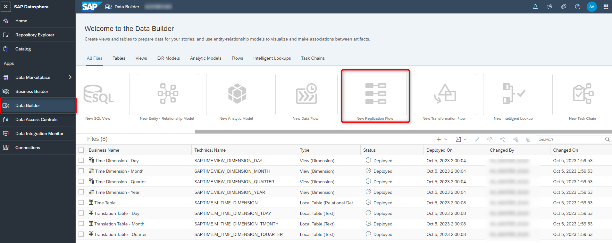
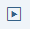
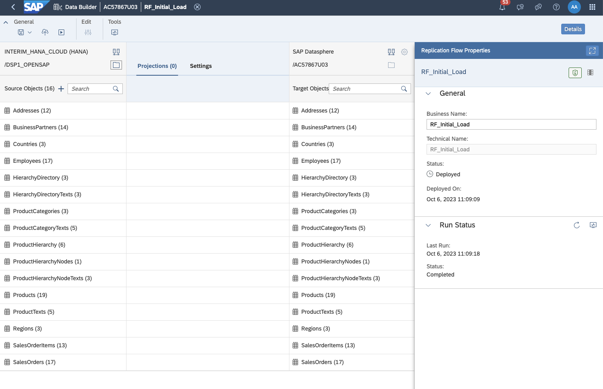
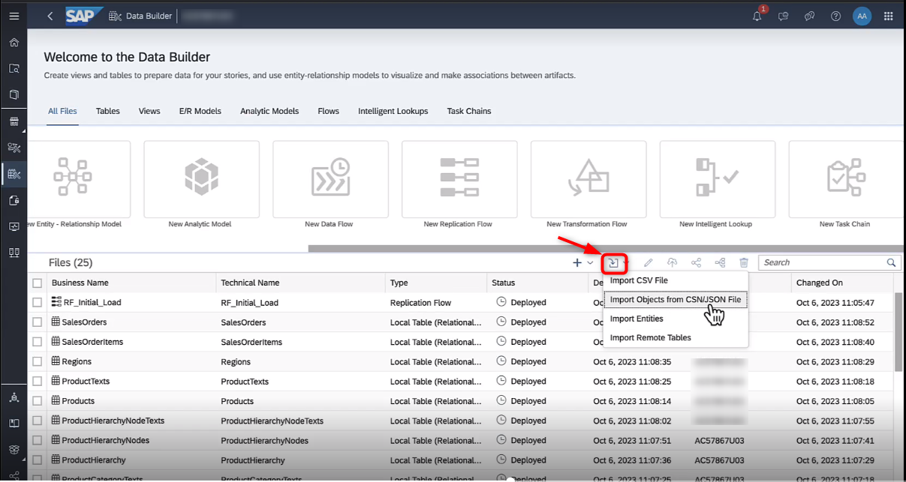
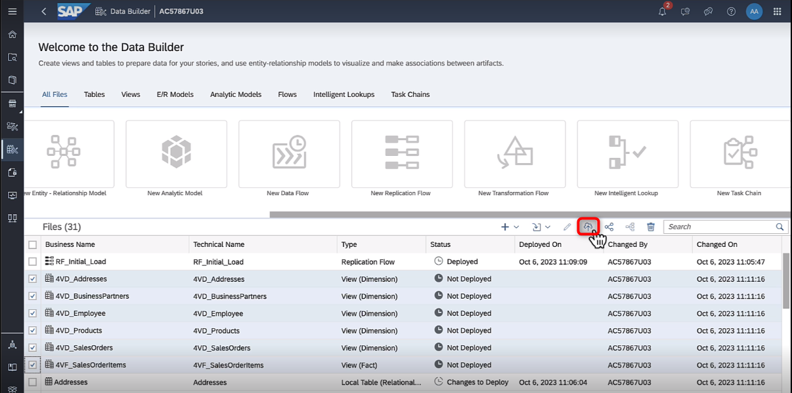
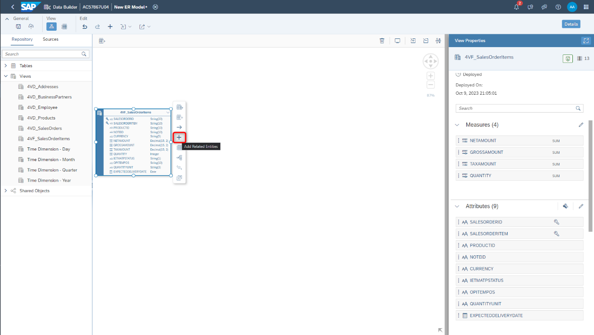
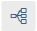

# Exercise 0 - Getting Started - Preparing your system

**Section Goal:** Load all required data & models that are the base line for the following exercises.

We have prepared a simple data model to analyze product sales for a typical company. For this exercise we will simply load this model with connections to the associated data from a CSN file so we can focus on the Analytic Model.

If you want to learn how to create data layer ER models like this, go here...

## Steps

-   Download CSN file from Github [[link](../../model/DA271_DataModel%20-%20Quick%20Start.json)]
-   Select the menu option **Data Builder** on the left-hand side
-   Select the option **New Replication Flow**

    

-   Create a new replication flow to import all relevant tables from the **HANA Cloud** connection, **DSP1_OPENSAP** container (source connection) to **SAP Datasphere** (target connection)
-   Select the following 16 source objects:
    -   Addresses
    -   BusinessPartners
    -   Countries
    -   Employees
    -   HierarchyDirectory
    -   HierarchyDirectoryTexts
    -   ProductCategories
    -   ProductCategoryTexts
    -   ProductHierarchy
    -   ProductHierarchyNodes
    -   ProductHierarchyNodesTexts
    -   Products
    -   ProductTexts
    -   Regions
    -   SalesOrderItems
    -   SalesOrder
-   Once the objects have been added, click the **Deploy**  button (top-left of screen) to save and render your replication flow ready to use. Save the flow as **RF_Initial_Load**
-   Once your RF is deployed, click the **Run** button (top-left of screen). This allows your local repository to house the source tables you imported from HANA Cloud.

    

-   Once replication flow’s run has completed, import the CSN file from the **Data Builder** screen

    

-   You will be prompted to select the objects you want to import. Select the objects with the status of “Ready to Import” and click **Import CSN File**.
-   Once those objects are imported, you’ll need to deploy them.

    

-   Now you have all the datasets needed to begin crafting your ER model. On the **Data Builder** screen, select on the **E/R Models** tab, and click on the **New Entity – Relationship Model**
-   Within the **Repository** section (left panel), under **Views**, you will find the entities necessary to create your initial ER model.
-   Drag the **4VF_SalesOrderItems** entity onto the canvas
-   To add related entities, click on the entity and select the “**+**” sign

    

-   Select all the related entities for **4VF_SalesOrderItems**; you will add the additional related entities using the same method until your ER looks like this

    

-   **Deploy** your model and name it **4EM_Overview_Simple**
-   Within the View Properties section, you can inspect the **attributes** and **measures** associated with a given entity. You can preview the data by clicking on the entity and clicking on the **Preview Data** button. You can also view the lineage of an entity by clicking on the **Impact and Lineage Analysis**  button

## Summary

Now that you have your data and data model uploaded, we can continue to data modeling.

Continue to - [Exercise 1 - Create Analytic Model](../ex1/README.md)
