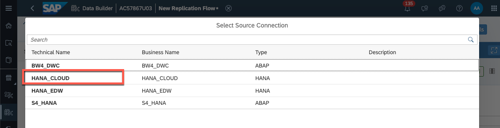
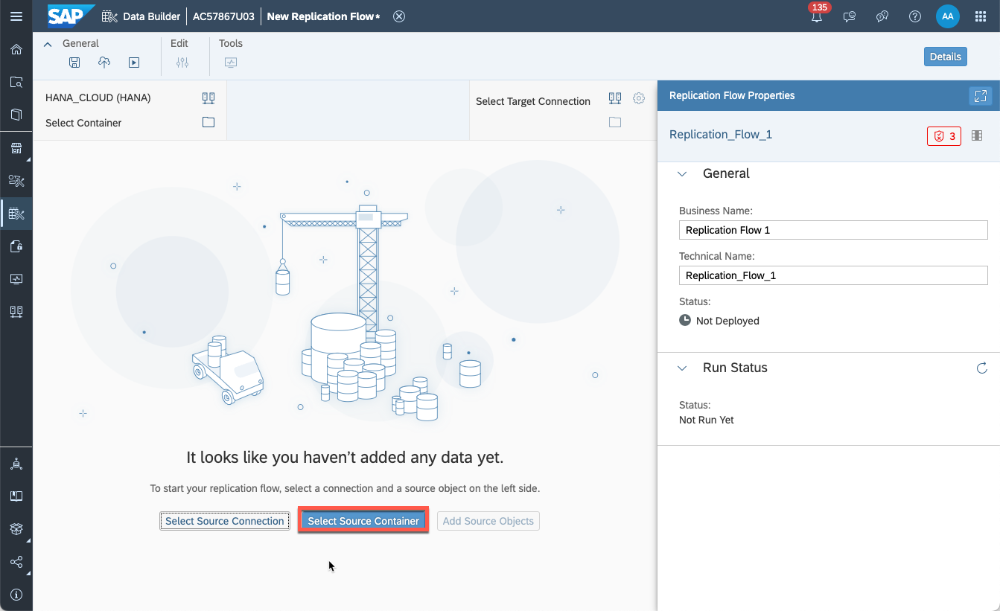

# Exercise 0 - Getting Started - Preparing your system

**Section Goal:** Load all required data & models that are the base line for the following exercises.

We have prepared a simple data model to analyze product sales for a prototypical company. For this exercise we will simply load some basic sales tables and their data via replication from SAP HANA Cloud and add a minimal data model by importing a data model file (aka: ["CSN import"](https://help.sap.com/docs/SAP_DATASPHERE/c8a54ee704e94e15926551293243fd1d/23599e6347fb4c9e9a71c82f62449875.html)). This brings us quickly to the starting line of all subsequent exercises.

For better overview of the imported objects and their relationships & details, you'll also create an [entity-relationship model](https://help.sap.com/docs/SAP_DATASPHERE/c8a54ee704e94e15926551293243fd1d/a91c042549fb497384e756d5f5c71fde.html) and inspect the objects in the [impact & lineage analysis](https://help.sap.com/docs/SAP_DATASPHERE/c8a54ee704e94e15926551293243fd1d/9da4892cb0e4427ab80ad8d89e6676b8.html).

:warning: If you are not using an SAP academy system (TechEd 2023) or an SAP Guided Experience system (cp. [Exercise Requirements](../../README.md#prerequisites)), please jump to chapter **Steps in your own SAP Datasphere system** 

## Steps in SAP Academy systems and SAP Guided Experience Systems
If your system is an SAP Academy system (URL contains "academy") or an SAP Guided Experience system (URL contains "guided-experience-datasphere") the following steps are for you
### Use replication flow to import base tables of object model

-   Select the menu option **Data Builder** on the left-hand side
-   Select the option **New Replication Flow**

    

-   Create a new replication flow to import all relevant tables from source connection **HANA_CLOUD** and container **DSP1_OPENSAP** into target connection **SAP Datasphere**: 
    - Select source connection 
    
    - select HANA_CLOUD as connection from which entities are to be replicated 
    
    - select to import from source container **DSP1_OPENSAP**
     
    
    -select target connection **SAP Datasphere**  
     
    
    - launch selection of source objects to replicate 
    
-   Select the following 16 source objects:
    -   Addresses
    -   BusinessPartners - Business Partners
    -   Countries
    -   Employees
    -   HierarchyDirectory - Hierarchy Directory
    -   HierarchyDirectoryTexts - Hierarchy Directory Texts
    -   ProductCategories - Product Categories
    -   ProductCategoryTexts
    -   ProductHierarchy
    -   ProductHierarchyNodes - Product Hierarchy Nodes
    -   ProductHierarchyNodesTexts - Product Hierarchy Nodes
    -   Products
    -   ProductTexts
    -   Regions
    -   SalesOrderItems
    -   SalesOrder - Sales Orders  
    
    - Confirm the next dialog
    
    - Your screen should now look like this  
    
-   Now choose **Deploy** button (top-left of screen) to save and render your replication flow ready to use. Save the flow as **RF_Initial_Load**
-   Once your RF is deployed, click the **Run** button (top-left of screen). This allows your local repository to house the source tables you imported from HANA Cloud. Once the run is finished, your final screen will look like this:  

### Import data model as CSN

-   Once replication flow’s run has completed, download the object model description (aka "CSN file") from Github [[link](../../model/DA271_DataModel%20-%20Quick%20Start.json)]
- Go back to the main screen of **Data Builder** and import the object model file via *+ > Import Objects from CSN/JSON file*  

-   You will be prompted to select the objects you want to import. Select the objects with the status of “Ready to Import” and click **Import CSN File**.
-   When prompted, if you want to reimport existing objects, choose to not reimport them, i.e. **Click No** 
-   Once those objects are imported, you’ll need to deploy them. Select all object that are not yet deployed and deploy them together
 

Now you have all the tables, their data and a minimal data model ready in the system. You should now start crafting your entity-relationship model. 

### Create entity-relationship model
-   On the **Data Builder** screen, select on the **E/R Models** tab, and click on the **New Entity – Relationship Model**
-   Within the **Repository** section (left panel), under **Views**, you will find the entities necessary to create your initial ER model.
-   Drag the **4VF_SalesOrderItems** entity onto the canvas
-   To add related entities, click on the entity and select the “**+**” sign. In the subsequent dialog choose to add all related entities and confirm.  

-   Select all the related entities for **4VF_SalesOrderItems**; you will add the additional related entities using the same method until your ER looks like this  

-   **Deploy** your model and name it **4EM_Overview_Simple**
-   To inspect all entities, select each one and inspect the View Properties panel on the right side of the screen. This gives details on their properties like semantic usage, columns, measures & attributes (only for 4VF_SalesOrderItems), semantic types as well as associations (also visible in the ER model itself). You can also preview the data of an entity by clicking on the entity and clicking on the **Preview Data** button on the top left. 

- You can also view the impact & lineage graph of an entity by clicking on the **Impact and Lineage Analysis** button that exists on every node. Note that the subsequent popup makes a differentiation between data lineage and dependency lineage (cp. [SAP Help Documentation](https://help.sap.com/docs/SAP_DATASPHERE/c8a54ee704e94e15926551293243fd1d/9da4892cb0e4427ab80ad8d89e6676b8.html#loio9da4892cb0e4427ab80ad8d89e6676b8__section_dependency_analysis)).

## Steps in all other SAP Datasphere systems
You can 

## Summary

Now that you have your data and data model uploaded, we can continue with the core of session's exercises. 

Continue to - [Exercise 1 - Create Analytic Model](../ex1/)
