# 

# Exercise 1: Build Analytic Model to prepare data consumption for end-user

**Goal**: In this step we prepare consumption of the imported data model via an Analytic Model. We start with a minimal model and subsequently enhance it step by step. On the way, we get to know the features of the Analytic Model editor including adding of dimensions, modelling of measures, preparation of variables and previewing data.

## Create Initial Analytic Model

We will now create an Analytic Model to support consumption of the imported data model.

User Steps:

-   Select the menu option **Data Builder** on the left-hand side
-   Under the **Analytic Model** tab, click on **New Analytic Model**
-   Drag view **4VF_SalesOrderItems** from the left panel and drop it onto the canvas.
-   The system analyzes its structure (i.e. measures, attributes & assocations) and let's you select which one to include by default
    -   **Enable** all measures and attributes, as well as the associated dimensions, and click **Import**

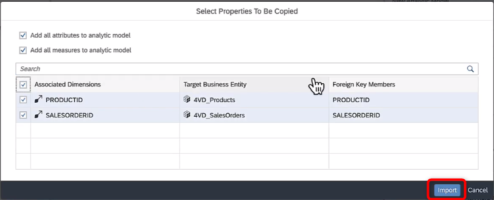

This is a first, minimal model that you'll subsequently enhance step by step.

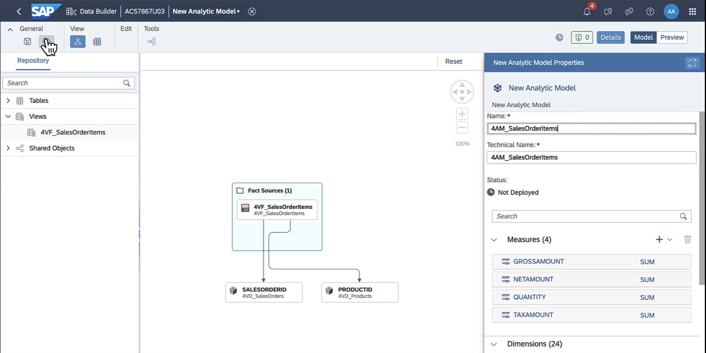

-   **Deploy** your model and name it **4AM_SalesOrderItems**
-   **Preview** the data

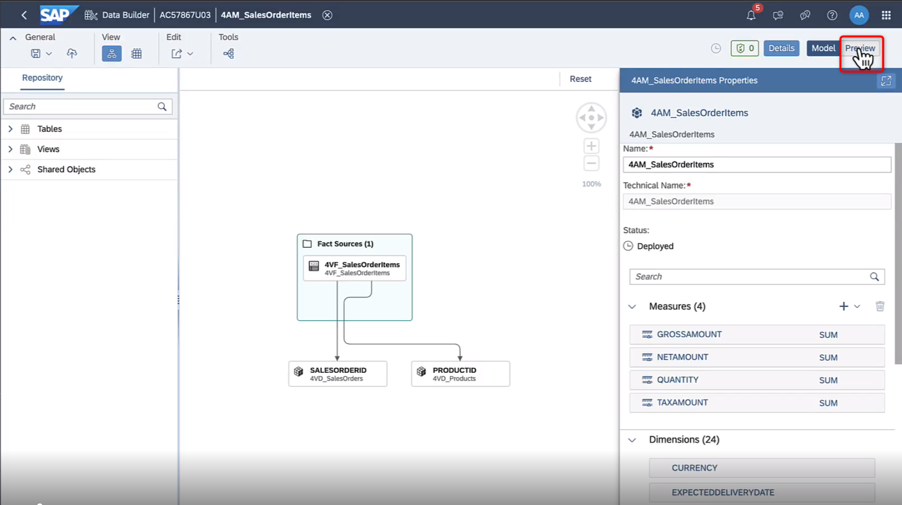

Check various dimensions to drill by, change their order, add a filter, etc.: 
-   The **Builder** panel is automatically displayed at the right side of the application. You can show it or hide it by choosing **Query Builder Designer Panel** .
-   In section **Available Objects**, you see a list of all available measures & dimensions of the Analytic Model. Here you can select dimensions and measures and assign them directly to the table's rows or columns by clicking  (add as column) or  (add as row).
-   In the screenshot below, all measures have been selected and are being examined by dimension PRODUCTID. Additional dimensions could be added also and their order rearranged via drag & drop. 

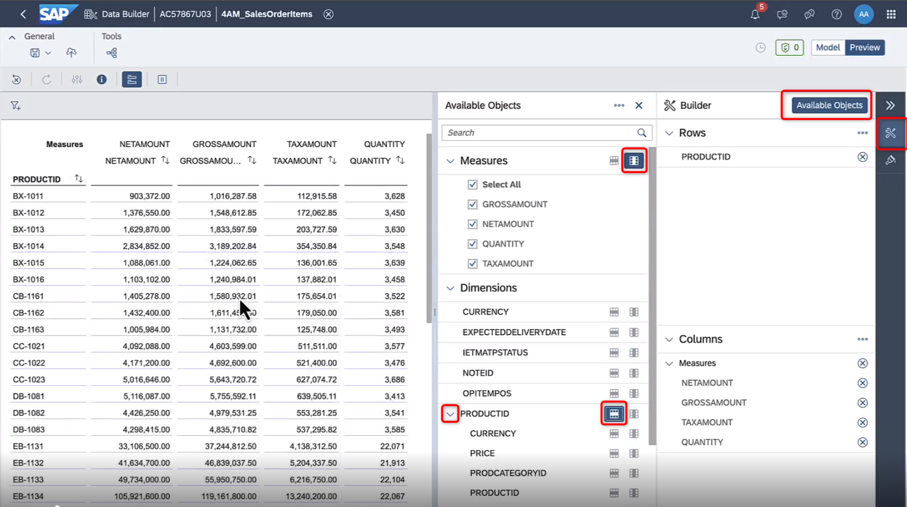

-   You can set filter on dimensions and measures using the  button (top-left area)
-   Click on **Model** to return to your analytic model

## Add Associated Dimensions

Add additional drill-dimensions by adding nested dimensions

User steps:

-   Select node the **SALESORDERID** (**4VD_SalesOrders** dimension) in the canvas. This will update the properties panel on the right. 
-   Within the properties panel, in section **Associated Dimensions** section, select dimensions **PARTNERID, RESPONSIBLE & CREATION DATE**  
These dimensions are automatically added to the canvas as well. 

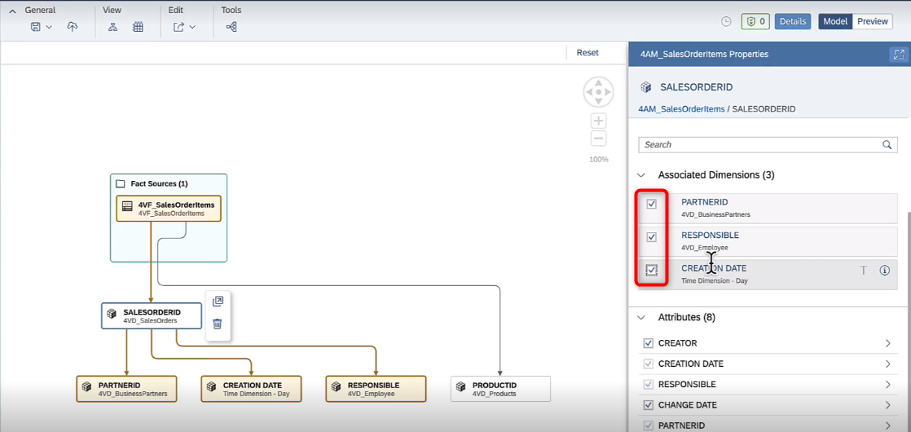

-   To get addresses of business partners, we similarly select node **PARTNERID** (**4VD_BusinessPartners**) and add its associated dimension **4VD_Address** dimension.  
The updated canvas will look like this:

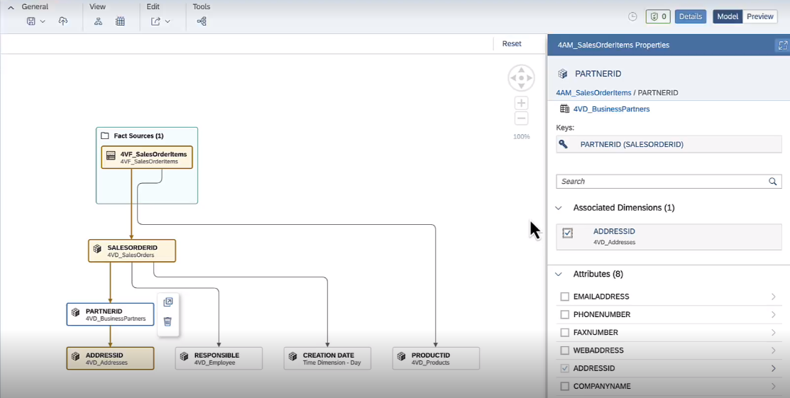

-   Within the **Attributes** section of **Properties**, enable the following attributes for the given dimensions:
    -   Choose node PARTNERID and select its attribute COMPANYNAME
    -   Choose node ADDRESSID and add attributes COUNTRY, REGION, CITY, STREET, POSTALCODE
-   Reopen data preview and confirm that you can now also drill by these dimensions (if, for any reason you do not see your added dimensions, **deploy** your Analytic Model first before continuing to preview data)

## Add Measures

Add calculated & restricted measures. In large organizations, its crucial to agree on common definition of KPIs. This is helpful for their reusability (saves time) and governance (all parties use the same definitions).

User steps:

-   Jump to the overview of the Analytic Model by clicking anywhere on the canvas (i.e. anything that is not a node). The properties panel will update to show the properties of the Analytic Model as a whole. 
-   To add a calculated measure, locate the **Measures** section within **Properties** and click the **+** sign. Select Calculated Measure

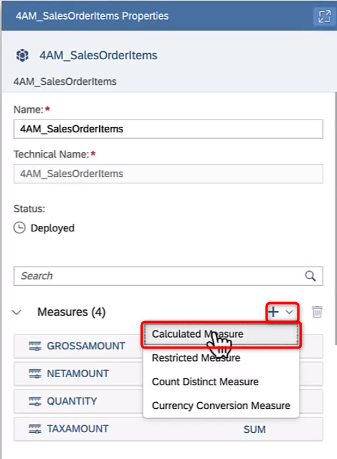

-   Add calculated measure Avg Price (Avg_Price) as GROSSAMOUNT / QUANTITY  
Note that you could also build much more complex measures by making use of the dimensions, variables (none defined yet) or operators. 

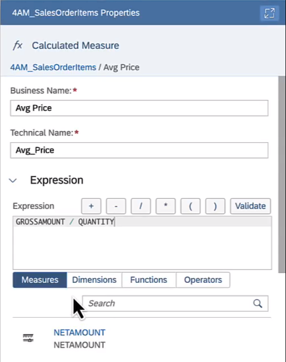

-   To navigate back to the main properties window, click on the object link, as shown below

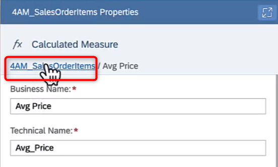

Let's now create **restricted measures**, i.e. measures that build on existing measures but restrict them along a filter. This is typically used for comparing values by status like e.g. comparing of the value of **all** orders with the value of **all open** orders. Here we'll compare domestic sales with international sales.  
-   Choose to create a measure of type **restricted measure**.
-   Create **Domestic Gross Sales** based on source measure GROSSAMOUNT and with restriction as COUNTRY = 'DE' in the expression
-   Create another restricted measure 
-   Call it **International Gross Sales**, base it on source measure GROSSAMOUNT and add restriction as COUNTRY != 'DE' in the expression

# Add variables
Analytic Models offer various variable types depending on usage, cp. [SAP Help](https://help.sap.com/docs/SAP_DATASPHERE/c8a54ee704e94e15926551293243fd1d/cdd8fa0fd74b495584dca343432f2814.html).

We'll simply use a filter variable to choose which years (multi-select) we want to see. If user does not set any filter, all data - regardless of creation year of the sales order - is selected. 
-   Find section **Variables** and a add a new variable of type **Filter variable**
-   Set filter on dimension **YEAR** with the filter type of **Multiple single values**

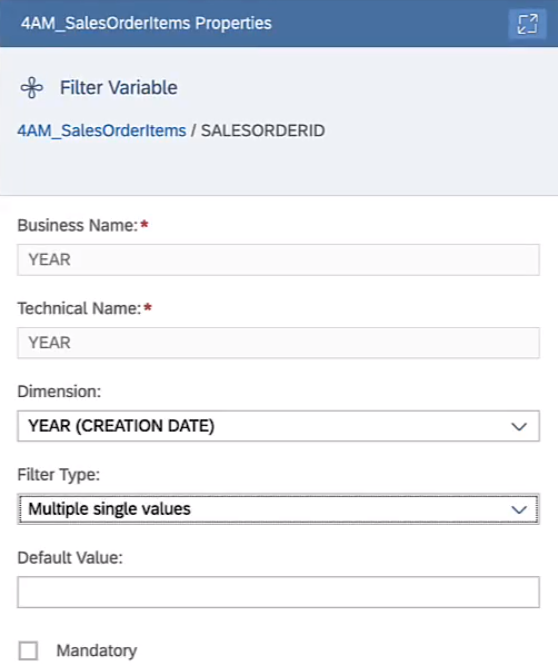  
Many users will want to see only data for e.g. the current year. With the prompt, they can now readily do. Similarly, we could set filters on region, country or other relevant dimensions. 

-   **Deploy** your Analytic Model
-   Preview data
-   You will be prompted automatically for the **Year** variable. 

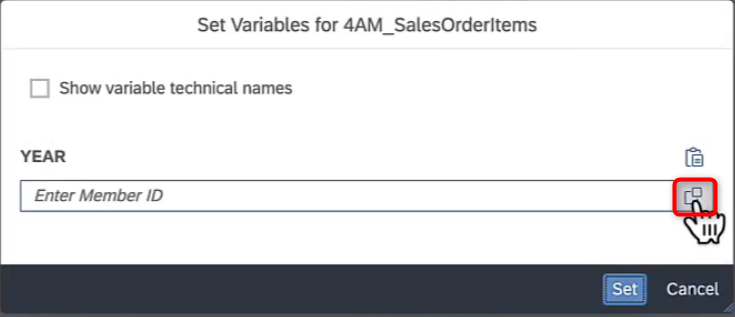

-   Open the value help and select years **2021, 2022, 2023** and click **OK** 
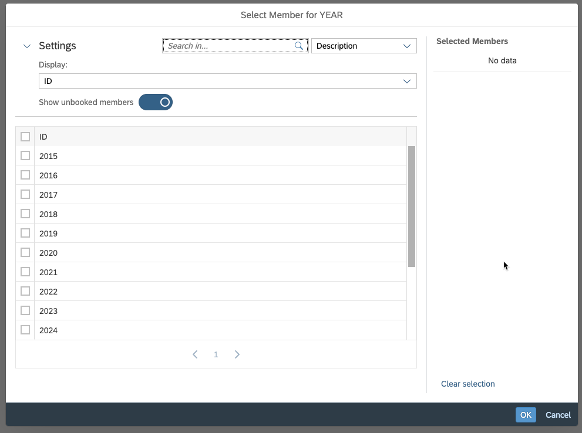

If you look closely, you might note that the measure values have changed
-   Under **Dimensions,** drill into **Creation Date** and enable the row on **YEAR** to reveal the filtered years. Confirm that only the selected years have indeed been retrieved by the system. 

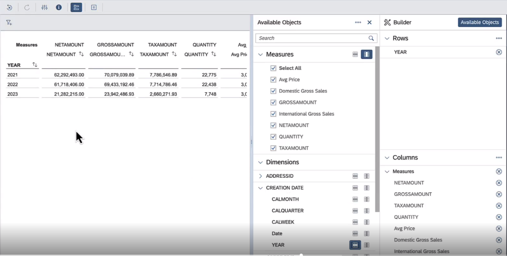

## Add Complex Measures 
Much more complex measures can be defined via Analytic Model functionalities like count distinct, constant selection or exception aggregation. All measures can also be stacked, resulting in potentially complex chains of calculations that modellers can consciously design. 

For the case at hand let's use count distinct & constant selection features to compute 
*   Share of overall sales
*   Avg sales by customer
This fixes their formular, but final results always depend on current drill-down & filter set by the analytics user. 

User Steps

-   Add **Restricted Measure** Gross Sales All Countries (Gross_Sales_All_Countries) based on measure GROSSAMOUNT and with an empty expression (i.e. no restriction)
-   Still within the same measure, activate **Constant Selection** on dimension COUNTRY (ADDRESSID)

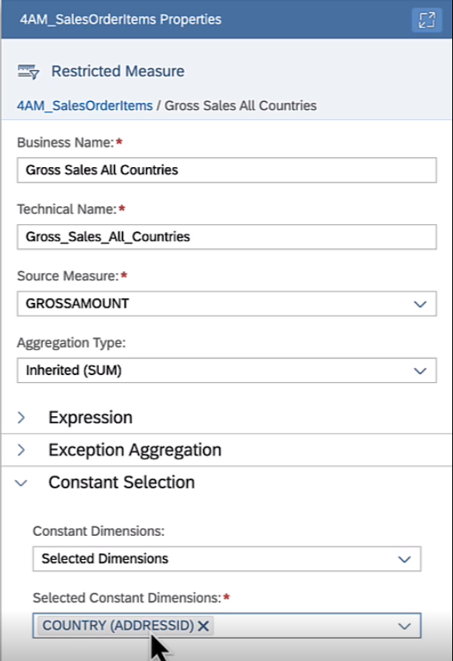

:information_source: **Constant Selection** ensures that for the measure at hand, a given dimension is taken out of drill-down or dynamic filter EVEN if it is a part of drill-down. This is important to compute reference figures (in this case, all countries) that can then be used as reference figure for display or subsequent calculations (like share of sales) 

Additionally, we could also have used a variable and used it in the restriction expression to make the list of reference countries configurable

Next, we use the measure for subsequent calculations: 
-   Add calculated measure **Share of All Countries Sales** (Share_Of_All_Countries_Sales) with expression *GROSS_AMOUNT / Gross_Sales_All_Countries*

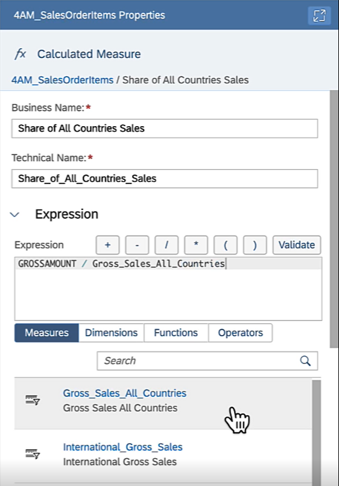

We are also interested in the average spend per customer. To that end, we count indiviual customers in the current drill-down and use that to compute their average spend amount. 

-   Add **Count Distinct Measure** Customer Count (CUSTOMER_COUNT) based on **Dimension** PARTNERID (SALESORDERID)

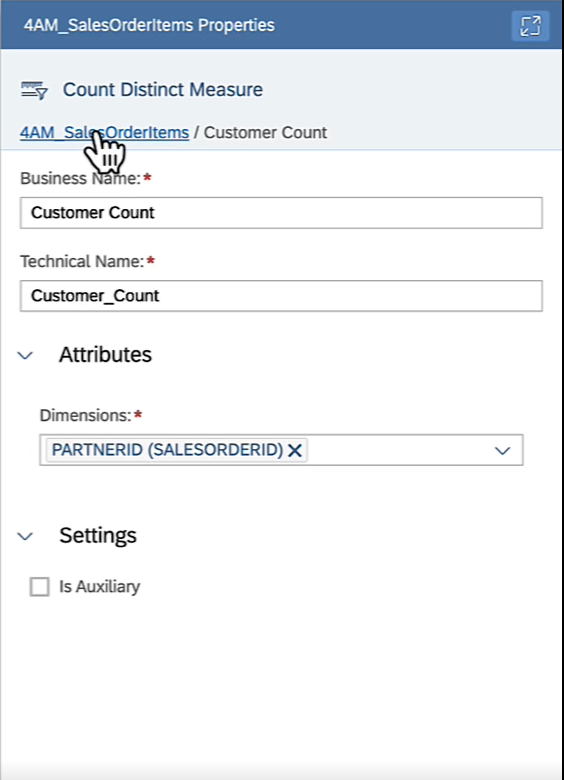

-   Add **Calculated Measure** Avg Spend per Customer (AVG_GROSSAMOUNT_PER_CUSTOMER) w expression GROSSAMOUNT / CUSTOMER_COUNT

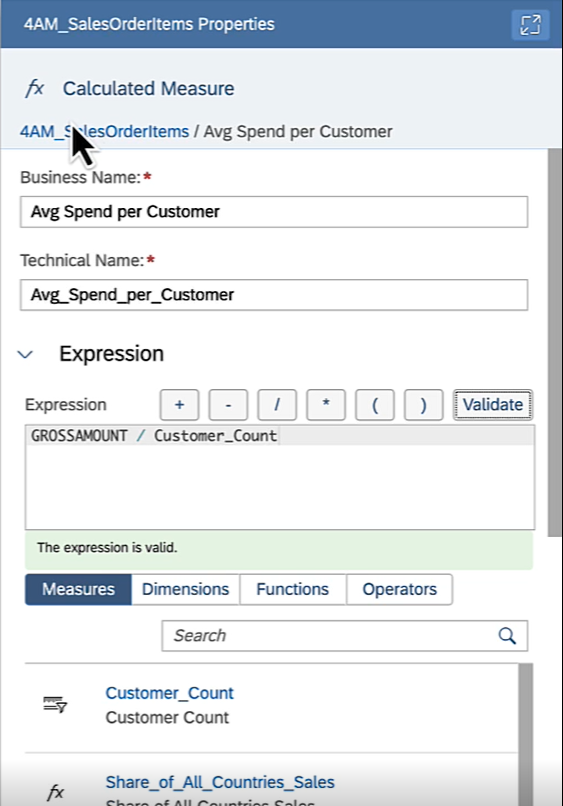

-   **Deploy** your Analytic Model
-   **Preview** data. 
    -   Drill by COUNTRY think about the results you see
    -   Take COUNTRY out of the drill and drill by PARTNERID only. Think about the results
    -   Drill by COUNTRY and PARTNERID and again understand what you see

## Motivate subsequent modelling steps Model Enhancements

We have come pretty far and the Analytic Model provides users with aligned KPI definitions and a multitude of drill possibiliites. Nonetheless we realize that the model is lacking in some crucial ways. If we healed those, our analytics users would have a much easier time and could also apply more flexible analyses. Concretely these are: 
*   No human-readable descriptions to all abreviations used like products code, company codes, employee IDs or region names
*   No hierarchical display of things that are inherently hierarchical like regional hierarchy, organizational hierarchy or product hierarchy
*   No details on currencies or units in the measures and certainly no automatic currency conversion 
Let's investigate where these topics hit us concretely. 

User Steps:

-   **Preview** data
-   Drill by REGION and COUNTRY. Realize the need to understand their respective abbreviations

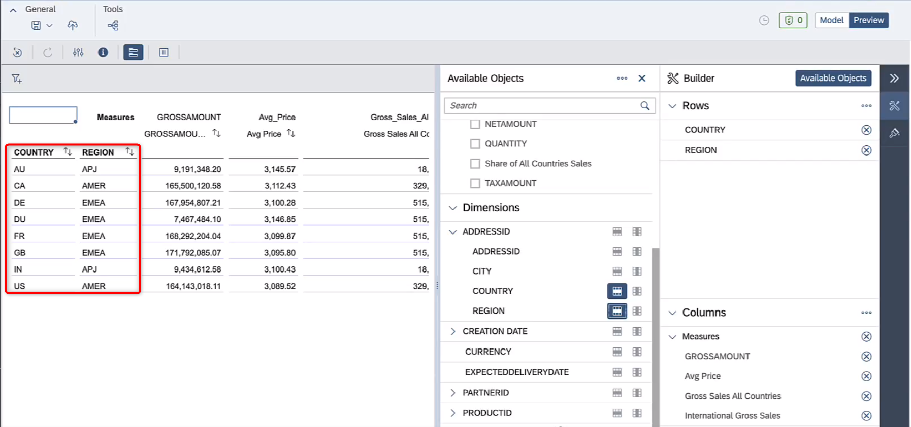

-   Drill by PARTNERID. Realize the need to also drill by COMPANYNAME to realize which customer this is

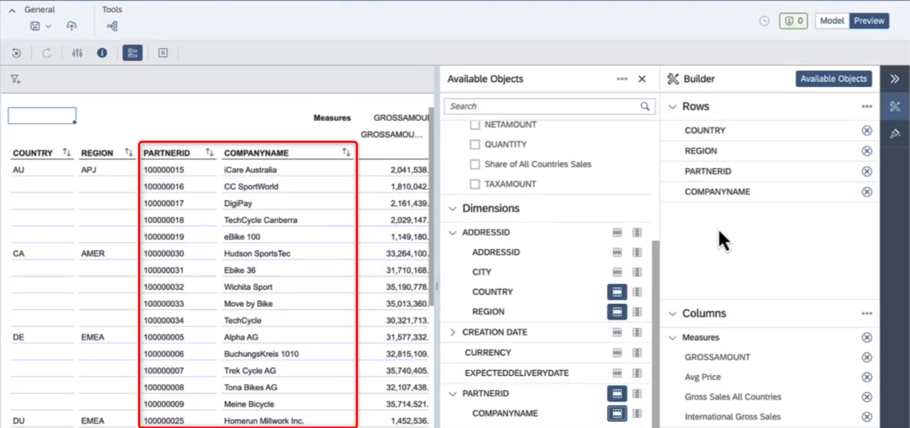

-   Drill by EMPLOYEEID. Realize you need to add Full Name into drill to realize which user this is. If you only drill by Full Name and two users had the same name, you'd not realize which individual this is. Also realize there is no way to know/see the organizational hierarchy

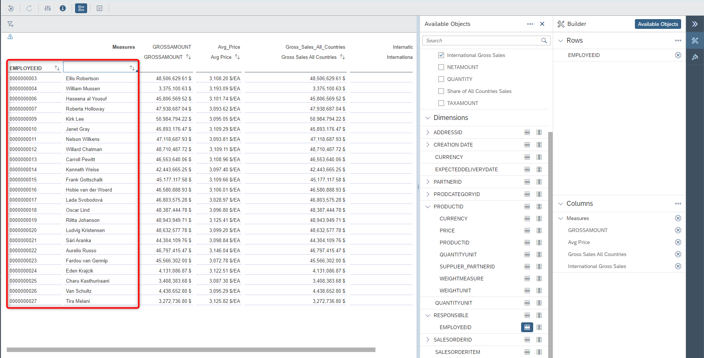

-   Drill by PRODUCTID & PRODUCTCATEGORY. Realize there are no product names or custom groupings of products (e.g. strategic products, low-end products or else)

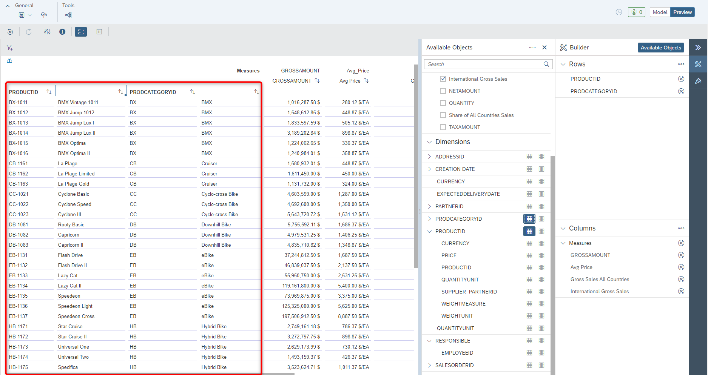

## Summary

You built an Analytic Model that provides a rich, analytical view on your data with governed KPI definitions, that contains a conscious selection of which dimensions to expose to end-users and also flexibly takes user input to e.g. filter or calculate. 

You have also double-checked all of your modelling by immediately previewing the data and flexibly analyzing it in a multi-dimensional grid. 

Continue to - [Exercise 2 - Add Labels & Internationalization](../ex2/README.md)
  :warning: If you are short on time, you can alternatively also choose to do the exercises on [hierarchies](../ex3/) or [currency conversion](../ex4/), since all exercises from now on are independent of each other. 
