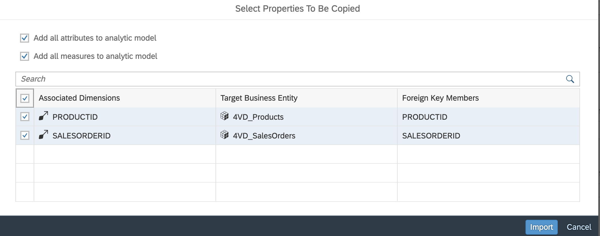

# Exercise 1 - Create Analytic Model

We will now create an Analytic Model to support consumption of the imported data model. 

We start with a minimal model and subsequently enhance it step by step. On the way, we get to know the features of the Analytic Model editor incl. adding of dimensions, modelling of measures, preparation of variables and previewing data. 

## Exercise 1.1 Create Initial Analytic Model

Initial run-through incl. data preview 

User Steps:  

Create Analytic Model w 4VF_SalesOrderItems as fact source.  

Choose to include all measures, attributes and associated dimensions 

Save & deploy as 4AM_SalesOrderItems  

Preview data. Check various dimensions to drill by, change their order, add a filter 

So there are all these measures and now you will drill by your product ID 

There are these three dots that eventually will become important. There's also a philtre that you can you can follow along, and if there was a prompt later on this this prompt button, this is all they need to do at the no at this point.

Fetzer, Jan 11 minutes 5 seconds
We're adding additional details on the sales order ID. So like the business partner, their response to employee or time information, we add additional information on the product ID. This none so far. So we're happy with what we're seeing. But on the partner, let's say we want to know about their company names on the responsibles. We want to know about their full names or for the Gration date, we are.

## Summary

You've now ...

Continue to - [Exercise 2 - Exercise 2 Description](../ex2/README.md)

