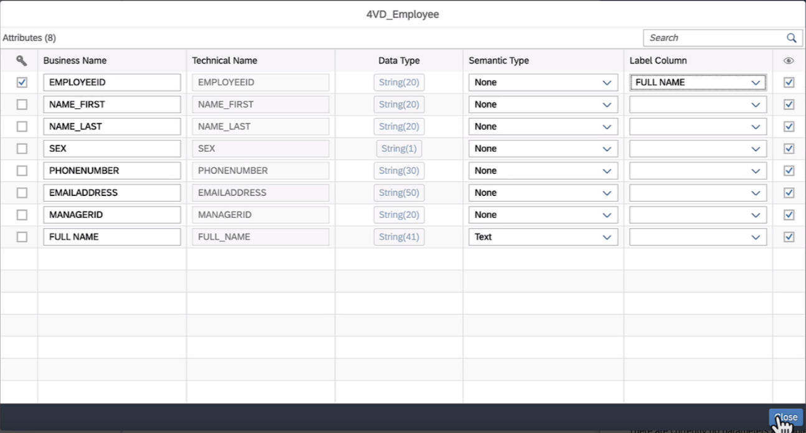
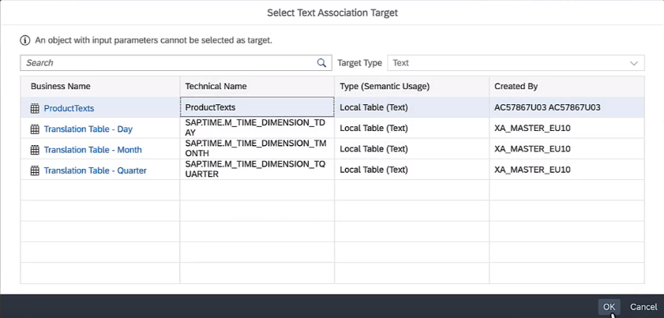
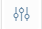
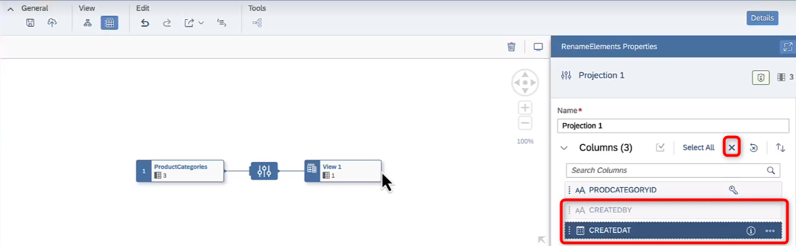
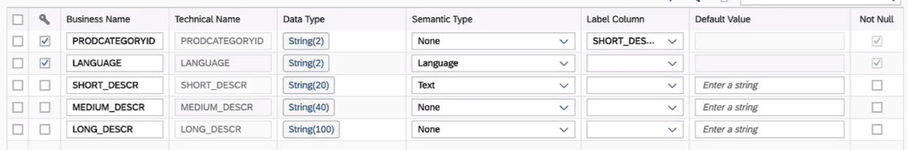
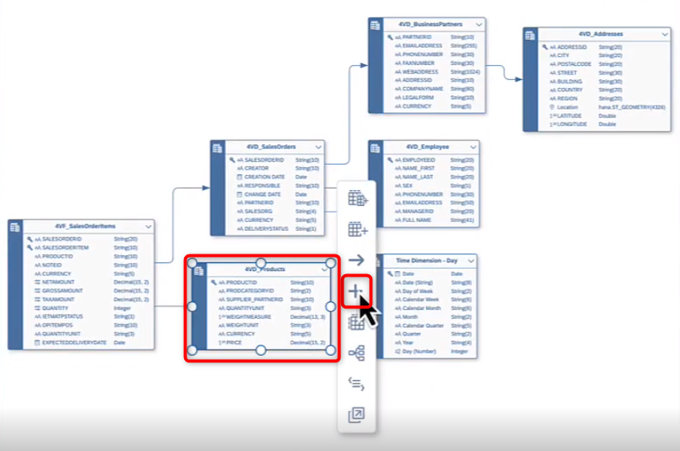
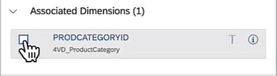
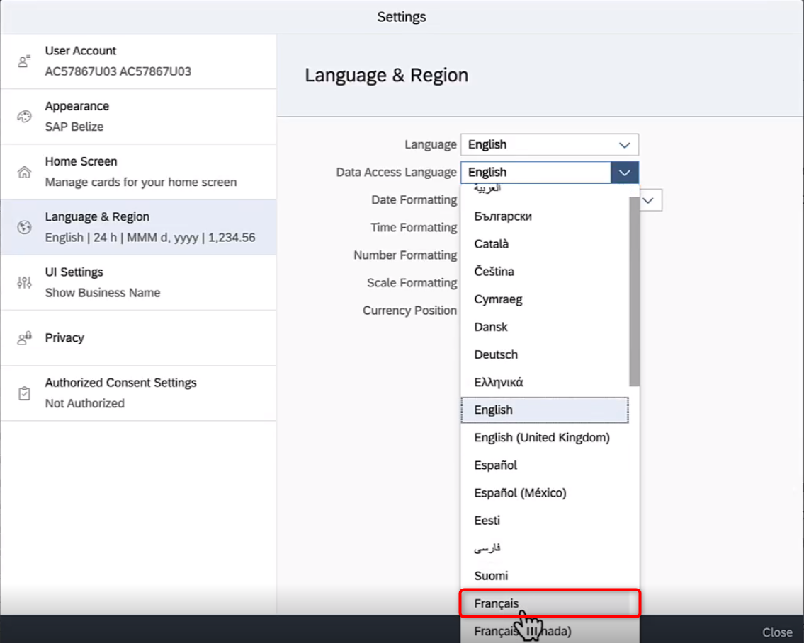
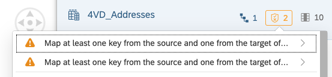

# Exercise 2 - Add Labels & Internationalization

In this exercise we enhance the data model such that we add labels to countries & regions as well as full names to employees.

## Add Language-independent Labels to Employees & Companies

In this exercise we deal with language-independent labels for company names & employees. These obviously don't change with the user language.

### Update Employee Labels

-   Open view **4VD_Employees**
-   Update labels by clicking on the pencil icon within the **Attributes** section of the **Model Properties**
    -   Set **Semantic Type** of FULL NAME to Text
    -   Set **Label Column** of EMPLOYEEID to FULL NAME

-   **Deploy** your view

### Update Company Labels

-   Open view **4VD_BusinessPartners**
    -   Set **Semantic Type** of COMPANYNAME to Text
    -   Set **Label Column** of PARTNERID to COMPANYNAME
-   **Deploy** your view

### Update Analytic Model and Preview Results

The new metadata needs to be considered also by the Analytic Model. For the metadata to persist, the Analytic Model page needs to be refreshed.

-   Open *4AM_SalesOrderItems* and refresh page
-   Confirm that dimension PARTNERID now has a capital T (for Text) next to itself in the dimension list
-   Confirm that RESPONSIBLE now also has a capital T next to itself in the dimension list
-   **Deploy** your Analytic Model
-   Open **Data Preview**
-   Drill by PARTNERID and confirm that company name is now displayed
-   Drill by RESPONSIBLE and confirm that employee's full name is now displayed
-   Under **Rows** within the **Builder**, check drill-settings (three dots in dimension list on the right) and change presentation from ID and Description to **Description and ID**.

## Add Language-independent Labels For Products and Product Categories

Users feel at ease if they see data in their native language rather than in some global language. To this end, SAP Datasphere provides the support of language-dependent labels. Depending on the data access language of the user (by default, this is their log-on language and native language), the labels for objects are drawn in that specific language.

The recommended modelling setup for this to work is as follows:

An entity of usage type Dimension uses a text association to link itself to an entity of type Text. The association uses the dimensions key field (not some other field!) to link to the key of the Text entity. If the key is comprised of several key fields (also known as "composite key" or "compound key"), then this is totally fine. It is not recommended, and a warning will be issued in cases where:

-   the text association does not start from a dimension (but e.g. a Fact) or
-   the text association is on a non-key field of the dimension

Both cases are technically supported, but a warning will be issued. Both cases should rather have a dimension in the middle whose key is used in the text association. We'll see more of this below.

### Add Language-Specific Names to Product Dimension

-   Open entity **ProductTexts** and perform the following updates:
    -   Change **Semantic Usage** to **Text**
    -   Within **Attributes**:
        -   Set **Semantic Type** of LANGUAGE to Language
        -   Set **semantic type** of SHORT_DESCR to Text
        -   Set **Label Column** of PRODUCTID to SHORT_DESCR
-   **Deploy** the table
-   Open entity **4VD_Products**
-   Within **Model Properties**, under **Associations**, add **Text Association** (+ sign) between 4VD_Products.PRODUCTID and ProductTexts

-   Ensure the mappings are correct (joined on PRODUCTID)
-   **Deploy** your view

As you see, we follow the standard way for language-dependent texts to work: a dimension (4VD_Products) with its key (here 4VD_Products .PRODUCTID) uses a **text association** to map to a text entity (here ProductTexts) and its key (here ProductTexts.PRODUCTID)

### Add Language-specific Names to Product Category

#### Create new Product Category Dimension

The product category so far is just an attribute of 4VD_Products. In order to comply w above-mentioned modelling best practices, we require a real product category dimension that subsequently links out to the Text entity for product category texts.

We'll therefore create a new dimension view for product categories and base it on the the imported table ProductCategories. We use the occasion to also hide fields that we don't want to expose to our analytics users (like CREATEDBY and CREATEDAT)

Since table ProductCategories only has three columns, the hiding of CREATEDBY and CREATEDAT leaves only a minimal dimension (consisting of just one field, PRODUCTCATEGORYID), but that's fine. In many more realistic cases there'd be own attributes to the category, like its category manager, a hierarchy on it or else, making it worthwhile to model this as a dimension in its own right.

-   Create new **Graphical View** from the **Data Builder**
-   Drag table **ProductCategories** into the canvas
-   Add a projection node and choose to exclude columns CREATEDBY and CREATEDAT by clicking on the column and selecting the **x**

-   Choose final node (in this case, View 1) and set **Semantic Usage** to Dimension
-   **Deploy** and save view as *4VD_ProductCategory*

#### Update Product Category Text Entity

-   Open entity ProductCategoryTexts perform the following updates
    -   Change **Semantic** **Usage** to Text
    -   Within **Attributes**:
        -   Set LANGUAGE to **Semantic Type** Language
        -   Set SHORT_DESCR to **Semantic Type** Text
        -   Set SHORT_DESCR as **Label Column** of PRODUCTCATEGORYID

-   **Deploy** your table
-   Open 4VD_Products and add an **Association** between 4VD_Products and 4VD_ProductCategory
-   Ensure mapping is correct (mapped on PRODUCTCATEGORYID)
-   **Deploy** your view
-   We are now going to add a **text association** on view **4VD_ProductCategory** between 4VD_ProductCategory.PRODUCTCATEGORYID and ProductCategoryTexts. PRODUCTCATEGORYID in the same way you’ve done previously
-   **Deploy** your view

### Update ER Model

We should update the ER model with the new objects and their relationships in order to always have a good overview of our overarching model. This is easy to do since we can leverage the newly drawn associations to add the respective entities.

-   Open ER Model **4EM_Overview_Simple**
-   Select node 4VD_Products and choose plus sign (+)

-   Choose to add related entities **4VD_ProductCategories** and **ProductTexts**
-   **Deploy** your ER model

### Update Analytic Model and Preview Results

The new metadata needs to be considered also by the Analytic Model. For it to take note of the updated metadata, the Analytic Model page needs to be loaded newly or refreshed. Subsequently you should save and deploy.

-   Open *4AM_SalesOrderItems* and refresh page
-   Confirm that dimension PRODUCTID now has a capital T (for Text) next to itself in the dimension list
-   Open node PRODUCTID and choose to add associated dimension PRODCATEGORYID. Note that it also has a capital T (for Text)

-   **Deploy** your analytic model
-   Open **Data Preview**
-   Drill by PRODUCTID and confirm that Product Names are now being displayed
-   Drill by PRODCATEGORYID and confirm that the category ID name is now displayed
-   Change settings of your user by clicking on your user profile in the top-right of the application. In section **Language & Region**, change **Data Access Language** from English to French.

-   Confirm with **Close**
-   Repeat drilling by PRODUCTID and PRODCATEGORYID. Confirm that you now see French texts for products and their category.

## Add Language-independent Labels For Countries & Regions

### Add Country Text

-   Open entity **Countries** and perform the following updates:
    -   Add **Semantic Usage** to text
    -   Within **Attributes**:
        -   Set LANGUAGE to **semantic type** Language
        -   Set COUNTRYTEXT to **semantic type** Text
        -   Set COUNTRYTEXT as **label column** of COUNTRYCODE
-   **Deploy** your view

### Add Region Text

-   Open entity **Region** and perform the following updates
    -   Add **Semantic Type** to Text
    -   Set LANGUAGE to **Semantic Type** Language
    -   Set REGIONTEXT to **Semantic Type** Text
    -   Set REGIONTEXT as **Label Column** of REGIONCODE
-   **Deploy** your view

### Update Addresses view

-   Open entity **4VD_Addresses**
-   Add **Text** **Association** between 4VD_Addresses and its attribute COUNTRY and Countries.COUNTRYCODE
-   If mapping is missing, simply drag COUNTRY column to COUNTRYCODE
-   Add **Text Association** between 4VD_Addresses and its attribute REGION and REGION.REGIONCODE
-   If mapping is missing, simply drag REGION column to REGIONCODE
-   Note: The warning about key mapping in the properties of 4VD_Addresses. This is because of the above-mentioned modelling best practices. Here, the text association from 4VD_Address to the text entities for country text & region text are not using the key of 4VD_Addresses. For cleaner modelling, there should be a Country dimension and a Region dimension that are put in between like we did above for product categories.

-   **Deploy** your view

### Update ER Model

We should update the ER model w the new objects and their relationships in order to always have a good overview of our overarching model. This is easy to do since we can leverage the newly drawn associations to add the respective entities.

-   Open ER Model **4EM_Overview_Simple**
-   Select node **4VD_Addresses** in the canvas and choose plus sign (+)
-   Choose to add related text entities **Countries** & **Regions**
-   **Deploy** your ER Model

### Update Analytic Model and Preview Results

The new metadata needs to be considered also by the Analytic Model. For the metadata to persist, the Analytic Model page needs to be refreshed. Subsequently you should save and deploy.

-   Open *4AM_SalesOrderItems* and refresh page
-   Confirm that dimension COUNTRY now has a capital T next to itself in the dimension list
-   Confirm that REGION now also has a capital T next to itself in the dimension list
-   **Deploy** your Analytic Model
-   Open **Data Preview**
-   Drill by COUNTRY and confirm that country name is now displayed in French
-   Drill by REGION and confirm that region name is now displayed in French
-   Change settings of your user by clicking on your user profile in the top-right of the application. In section **Language & Region**, change **Data Access Language** from French to English
-   Repeat drilling by COUNTRY and REGION and confirm that all their texts are now displayed in English again.

## Summary

Great work! You were able to enhance the data model by adding labels, associations to expand our ER model and Analytic Model.

Continue to - [Exercise 3 – Hierarchies](../ex3/README.md)
