# Exercise 3 - Hierarchies

In this chapter we configure several hierarchies to use in our Analytic Model and preview the results.

The time dimension includes several hierachies (e.g. Year-Month-Day) that we will explore directly. We will then configure the organizational hierarchy of employees, regional hierarchy, and custom hierarchy for products to familiarize ourselves with their capabiliites & modelling requirements

## Explore time hierarchy

The time dimension *Time Dimension - Day* includes a "level-based hierarchy". Since each day belongs to a month, quarter and year, the system comes pre-loaded with common hierarchies that we can inspect in modelling and use in reporting

### Understand the pre-loaded level-based Time Dimension hierachy

-   Open ER Model
-   Choose node *Time Dimension - Day* to open its properties dialog
-   Click the hierarchy icon in the view properties

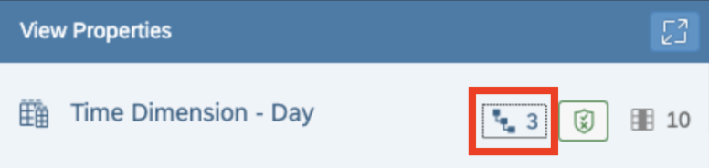

-   Inspect the three pre-delivered hierarchies

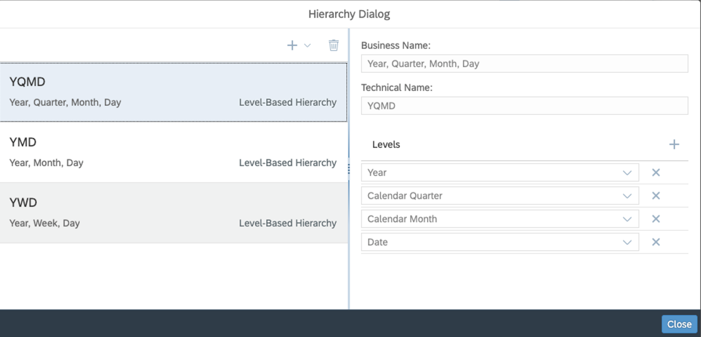

-   Open Analytic Model *SalesOrderItems*
-   Open Data Preview
-   Drill by CREATION DATE
-   Click the three dots to the right of CREATION DATE to select the hierarchy

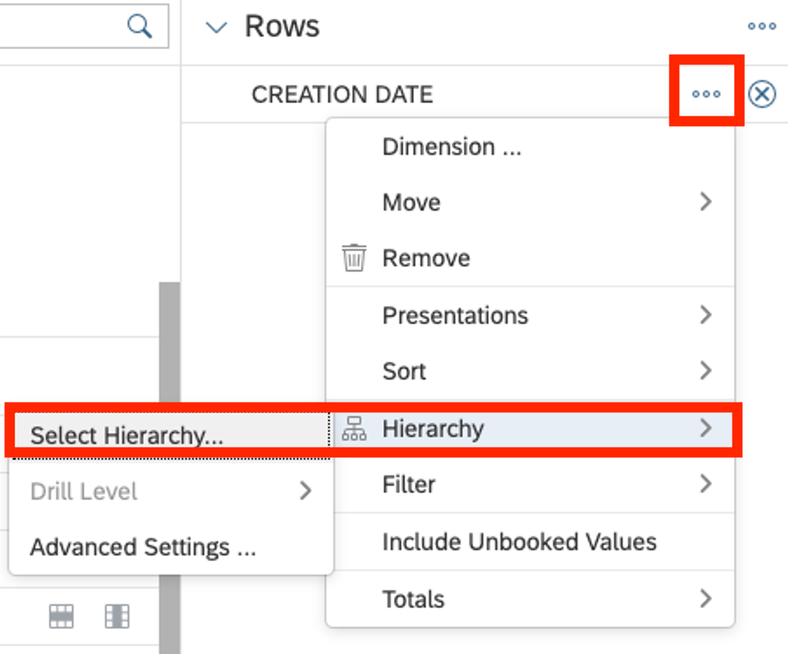

-   Click the three pre-delivered hierarchies

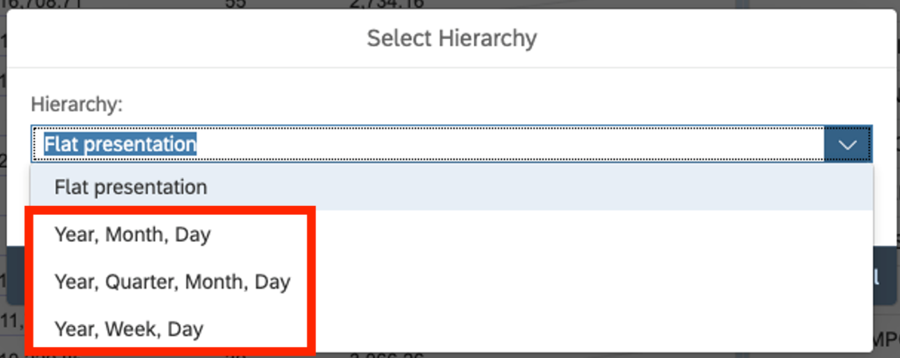

-   Choose hierarchy *Year, Month, Day*
-   Use the hierarchy drill-down to view the aggregation roll-ups for the node levels

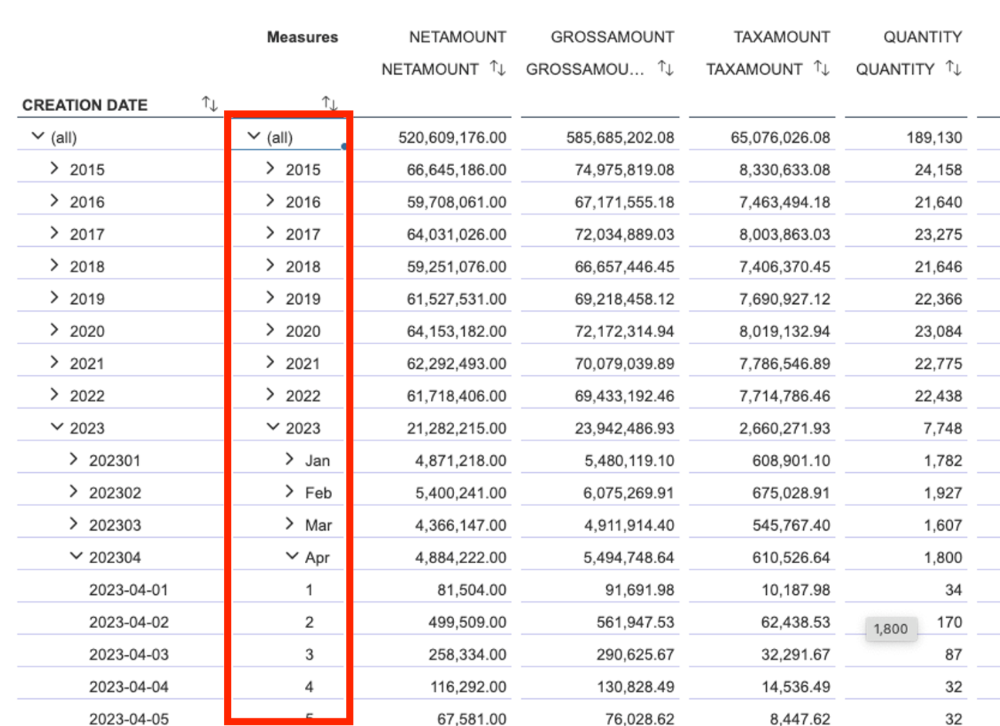

## Classic hierarchy model

SAP Datasphere has supported hierarchies for many years with two hierarchy models, namely

-   Level-based hierarchies and
-   Parent-child hierarchies

We'll use both types to understand their power and expressability.

In a subsequent chapter, we'll get to know the new, even more flexible "external hierarchies with directory" feature that has just been introduced in October 2023. This new capability provides many more features that are aligned with the classic model of S/4 and BW hierarchies so that those hierarchies can be imported and leveraged in Datasphere with most of their features.

### Create a regional, level-based hierarchy

We now follow the pattern of the time hierarchy to build a region hierarchy of Region-Country-City. Structurally, this is called a "level-based hierarchy" in which different column values of an entry together form a hierarchy. In the case at hand, each ADDRESSID has its respective values of REGION, COUNTRY and CITY. Together, they form a hierarchy. The classic example here is the time hierarchy that we saw above. Level-based hierarchies are "balanced", i.e. they always have the same depth in each subtree (here: depth = 3)

-   Open entity 4VD_Addresses
-   Click the hierarchy icon in the properties pane
-   Create new level-based hierarchy based on columns REGION-COUNTRY-CITY in that order

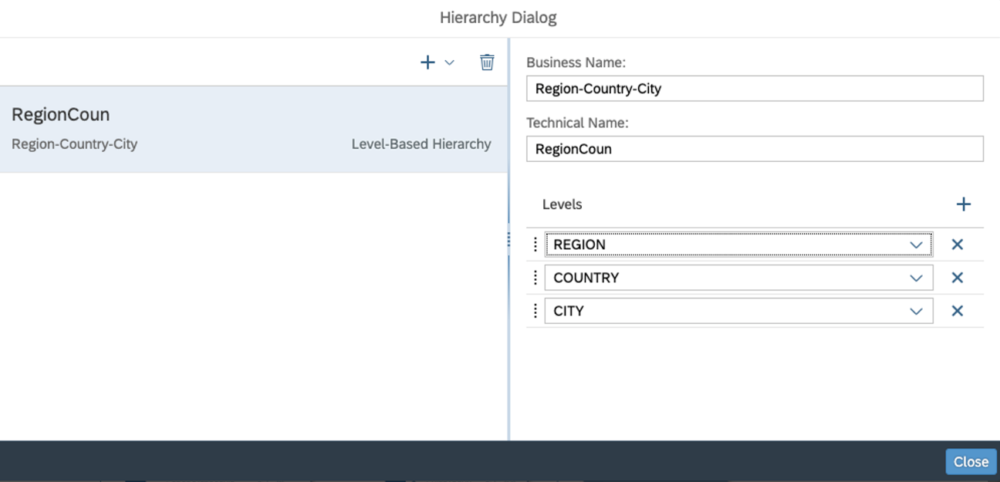

-   Save & Deploy

### Create organizational hierarchy of type parent-child hierarchy

For the organizational hierarchy, we leverage the reporting structure of the company. Each employee has a manager and we can therefore create a parent-child relationship between the two by configuring a "parent-child hierarchy". Unlike level-based hierarchies, parent-child hierarchies are typically not balanced since some managers might have only direct reports while others might manage managers who manage their own teams.

In our example data, each row in the entity 4VD_Employees has columns for the manager information. This is the simplest case of parent-child hierarchy to introduce the world of parent-child hierarchies.

-   Open entity 4VD_Employees
-   Click the hierarchy icon in the properties pane
-   Create new parent-child hierarchy and specify its properties like in the screenshot below
    -   Business name: Organizational Hierarchy
    -   Parent: MANAGERID
    -   CHILD: EMPLOYEEID

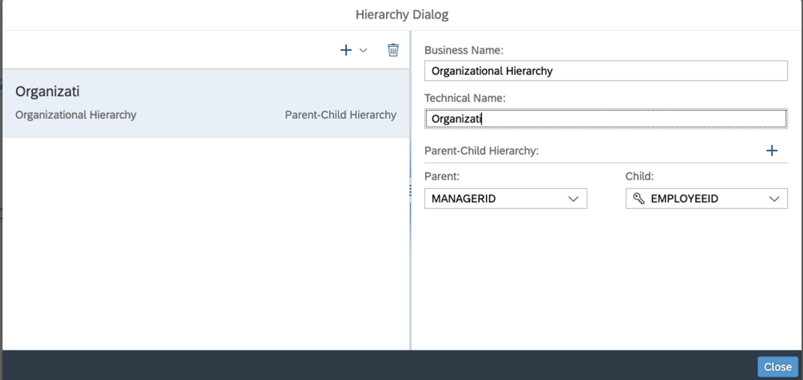

### Update Analytic Model and preview results

The Analytic Model page needs to be reopened or refreshed to load the updated Data Layer modeling. Then you should save and deploy.

-   Open *4AM_SalesOrderItems* and refresh page
-   Save & deploy
-   Open Data Preview
-   Drill by RESPONSIBLE
-   Open three dots next to RESPONSIBLE and choose to select another hierarchy

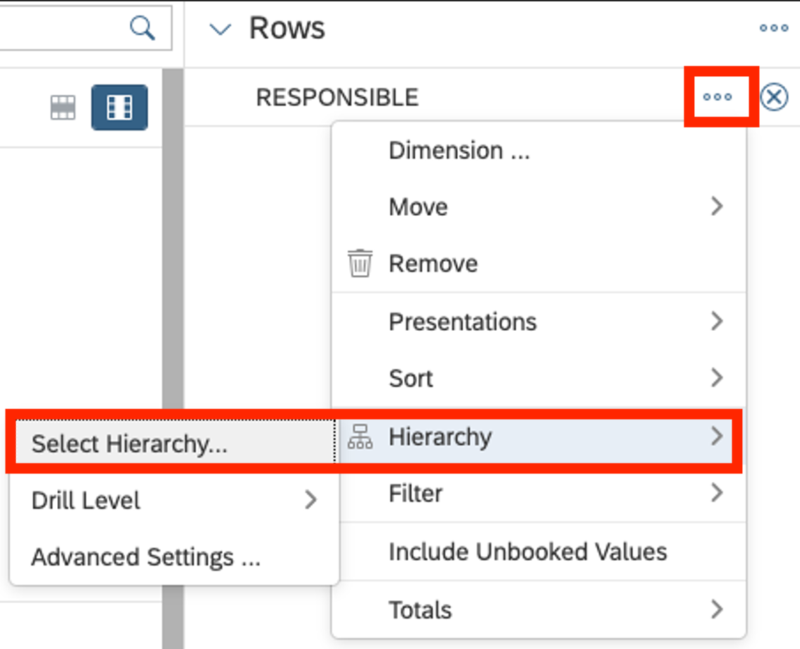

-   Choose Organizational Hierarchy from the list of hierarchies

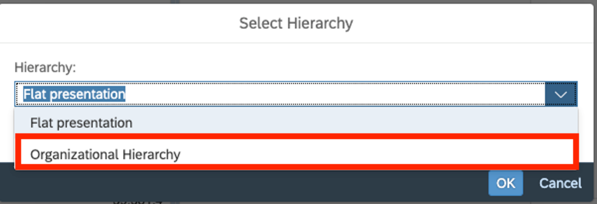

-   Organizational hierarchy is now used to display data. Rollups to intermediate nodes happens automatically!

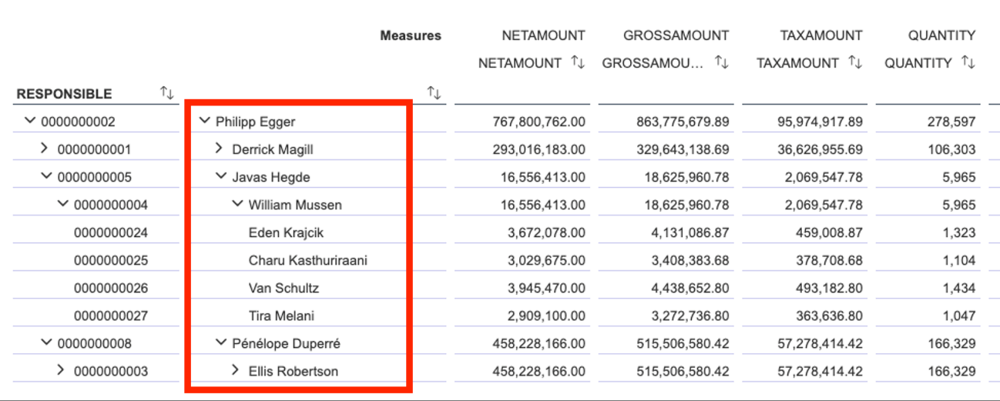

-   Drill by additional dimensions like e.g. COUNTRIES is fully supported

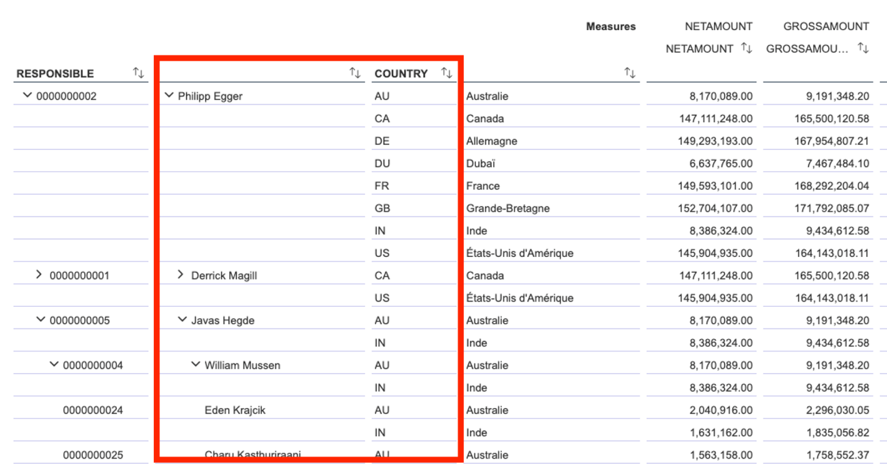

## External hierarchies with directories

In October 2023, SAP Datasphere introduced a revamped data model for parent-child hierarchies that is aligned with the SAP S/4 and SAP BW data models for hierarchies. This capability is called "[external hierarchies with directories](https://help.sap.com/docs/SAP_DATASPHERE/c8a54ee704e94e15926551293243fd1d/36c39eee184c485a80ebce9d0fec49ec.html)".

This improvement provides many more features than the classical parent-child hierarchies, namely

-   Support of S/4 and BW hierarchies and alignment w/ their data model
-   Data-driven definition of hierarchies
-   Support of Text Nodes (e.g. GL account groups - GL accounts)
-   Support of nodes of different dimensions within the same hierarchy (e.g. sales area - cost center – employee)
-   Language-dependent hierarchy descriptions
-   Language-dependent node texts
-   Time-dependent hierarchies
-   Time-dependent hierarchy nodes & their attributes

In the following exercise, we introduce a flexible categorization of products along usage (men-women-kids) and along marketing categories (Premium-Standard-Low and Flagship-Core-Others). The second marketing strategy is currently being developed and will only be set live at the beginning of the year, by leveraging time-dependency.

Note: We refrain from language-dependent hierarchy names & hierarchy nodes for simplicity, but you'd quickly be able to design the necessary text entities and associate them from the respective hierarchy directory & node entities if you are interested in that exercise.

### Create Hierarchy Directory Dimension

All hierarchies and their properties are listed in their own hierarchy directory dimension. During our initial data import, the HierarchyDirectory table was imported that has all required fields & data. We will make the respective modeling here directly on this view. However, in an enterprise environment we recommend not changing the directly imported Views and instead wrapping the view in a Graphical View so that our modeling does not change the base view.

Hierarchy directories are modelled as dimensions and the product hierarchy entity will later associate to it. Since we are configuring a time-dependent hierarchy (note that we will configure the new product strategy to only go live at the start of 2024), two special columns (VALIDFROM, VALIDTO) tell the system the validity period of each hierarchy. In order for the Analytic Model to leverage this information, we need to assign the corresponding semantic types. Then when selecting the hierarchies in the Analytic Model, the system will query the hierarchy directory table with the reference date provided by the users and return the hierarchies that are valid or the selected data.

-   Open local table *HierarchyDirectory*
-   Preview its data
-   In section General, change Semantic Usage to *Dimension*
-   In section Attributes, change
    -   For VALIDFROM, set semantic type to *Business Date - From*  
        For VALIDTO, set semantic type to *Business Date - To*
    -   For DESCRIPTION, set semantic type to *Text*
    -   For HIERARCHYID, set label column to *DESCRIPTION*
-   Save & deploy

Note that we model the description as a language-independent field here. If we wanted to have language-dependent hierarchies, we'd need to follow the steps we completed above above for product texts, where a text entity is created and associated to the dimension (here: HierarchyDirectory) via a text association.

As an additional exercise, you can use the provided table with language dependent data. That lesson is covered in... \*\* [from Jan's other recording!]\*\*

### Create Text Node Dimension

One of the new features in "external hierarchies with directories" is that node and leaves can belong to different dimensions. In the case of classical parent-child hierarchies like the one in 4VD_Employees, parent and child were always in the same dimension (i.e. each manager is also an employee).

With the new hierarchy capability, more complex hierarchies like sales areas that contain cost centers and cost centers who contain employees can be modelled. In the simplest case, the other dimension is just a plain text node (i.e. just an ID and a description, possibly language-specific), not a full-fledged dimension with plenty of other attributes (like a sales area)

During data import, a ProductHierarchyNodes table was imported. We'll update its semantics to become a dimension in its own right and tell the system which descriptions to draw for the nodes. Again, we could wrap the table in a view and do the changes there. In more productive scenarios, we'd highly suggest to add this additional level of abstraction, but for this eample we'll apply those changes directly on the table.

-   Open table *ProductHierarchyNodes*
-   Preview data
-   In section *General*, change Semantic Usage to *Dimension*
-   In section *Attributes*, do these changes
    -   For DESCRIPTION, set semantic type to *Text*
    -   For NODEID, set Label column to DESCRIPTION
-   Save & deploy

### Create entity for product hierarchy with directory

Now let's get to the actual hierarchy object. A new semantic usage "Hierarchy with Directory" has been introduced that contains information about the parent-child relationship, which of the multiple parallel hierarchies that relationship belongs to, the type of node (here: is the current node is a product or text node) and a redirection to the actual node key.

Note that the model makes a distinction between the key used in the parent-child relationship (here: NODEID) and the key used to identify the respective entity key (of the product or text node dimensions).

As before, the required data has been imported as local table ProductHierarchy during the setup steps. We could wrap this table in a view for an additional level of abstraction & flexibility or just update the table's semantic information like we do here.

-   Open table *ProductHierarchy*
-   Preview its data
-   In section Associations
    -   Create an association to dimension *HierarchyDirectory*  
        Map column *ProductHierarchy.HIERARCHY* to column *HierarchyDirectory.HIERARCHYID*
    -   Create an association to dimension *ProductHierarchyNodes*  
        Map column *ProductHierarchy.TEXTNODEID* to column *HierarchyDirectory.NODEID*
-   In section *General*, change Semantic Usage to *Hierarchy with Directory*. A new button Hierarchy with Directory Settings appears together with some error message that we haven't completed all modelling steps yet

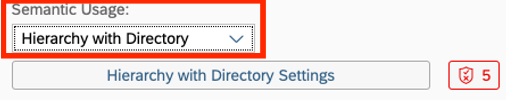

-   Click button Hierarchy with Directory Settings to open this configuration window

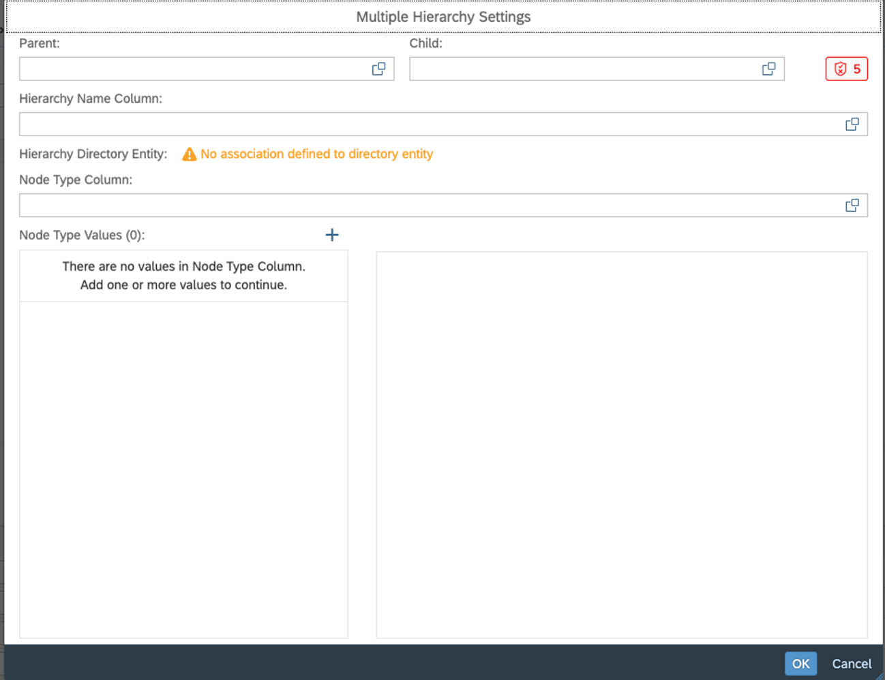

-   Fill the configuration window as follows
    -   Parent: PARENTID
    -   Child: CHILDID
    -   Hierarchy Name Column: HIERARCHY
    -   Node Type Column: NODETYPE
    -   Node Type Value \#1
        -   Node Type Value: ProductNode
        -   Set as Leaf: Checked
        -   Column 1: PRODUCTID
    -   Node Type Value \#2
        -   Node Type Value: TextNode
        -   Set as Leaf: Unchecked
        -   Column 1: TEXTNODEID

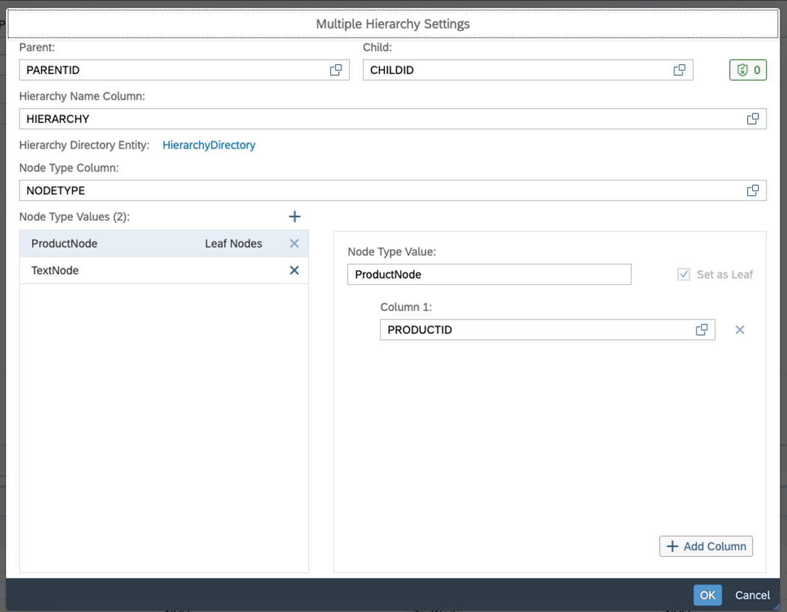

-   Save & Deploy

### Add external hierarchy to product dimension

Now to associate the new external hierarchy from the product dimension.

-   Open dimension 4VD_Products
-   Create new assocation of type "Hierarchy with Directory Association"

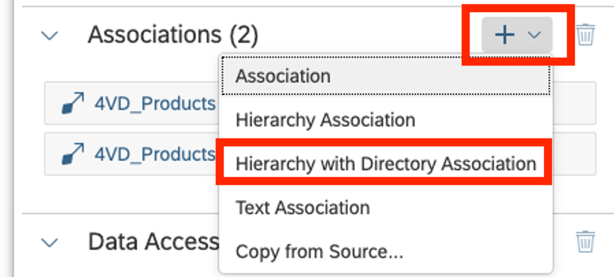

-   Choose ProductHierarchy from the list of suitable entities

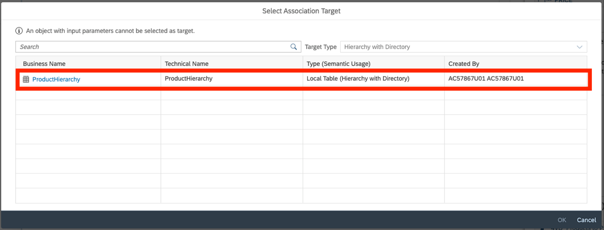

-   Save & Deploy

### Update Analytic Model and preview results

As a final step we update the Analytic Model to view the results from this modeling. Remember that the Analytic Model only loads newly updated metadata from lower layers when loading the editor or refreshing the browser page. Then you also need to save & deploy the updated model information.

-   Open *4AM_SalesOrderItems* and refresh its browser page
-   Save & deploy
-   Open Data Preview
-   Drill by PRODUCTID
-   Choose a hierarchy via the three dots in the Rows area of the Builder panel

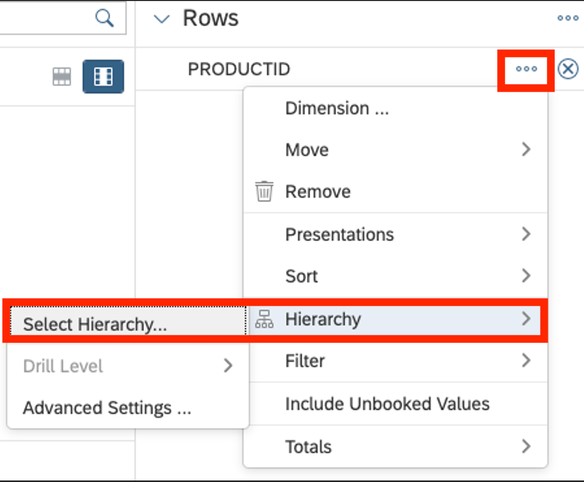

-   Drill by COUNTRY and confirm that country name is now displayed in French
-   Drill by REGION and confirm that region name is now displayed in French
-   Change data access settings of your user from French to English
-   Repeat drilling by COUNTRY and REGION and confirm that all their texts are now displayed in English again.

## Summary

Great work! You were able to configure several hierarchies to use in our Analytic Model and preview the results.

Continue to - [Exercise 4 – Currency Conversion](../ex4/README.md)
