# Exercise 3 - Hierarchies

In this chapter we configure several hierarchies to use in our Analytic Model and preview the results. Hierarchies come natural in many domains (time hierarchies, organizational hierarchies, product hierarchies in marketing etc.) and help users to get an overview of a situation (e.g. regional sales), get deeper (e.g. country sales) until they finally look at raw numbers (by city, client, product or else). Several hierarchies can exist and be used in parallel (e.g. drill across regional hierarchy AND product hierarchy), exist on the same domain (e.g. organizational setup changes) and even be time-dependent (marketing approach for categorizing your products in this year vs. next year). SAP Datasphere supports all of these requirements and actually much more. 

In this chapter, you'll learn 
*   what type of hierarchies exist
*   how to configure each one
*   how to use them in your data analysis

We'll go about as follows: 
* [inspect and use the time hierarchies](#explore-time-hierarchy) that come predelivered w/ your time data
* [build a simple level-based hierarchy for regions](#create-a-regional-level-based-hierarchy)
* [build a simple parent-child hierarchy for employees](#create-organizational-hierarchy-of-type-parent-child-hierarchy) and their managers
* [use the new concept of "external hierarchies with directories"](#external-hierarchies-with-directories) for data-driven, multi-language, multi-node, time-dependent hierarchies on for products and their categorization. 

## Explore time hierarchy

The time dimension *Time Dimension - Day* includes a "level-based hierarchy". Since each day belongs to a month, quarter and year, the system comes pre-loaded with common hierarchies that we can inspect in modelling and use in reporting

### Understand the pre-loaded level-based Time Dimension hierachy

-   Open ER Model
-   Choose node *Time Dimension - Day* and click the Details button in the top right to open its properties dialog
-   Click the hierarchy icon in the view properties

-   Inspect the three pre-delivered hierarchies

-   Open Analytic Model *4AM_SalesOrderItems*
-   Open **Preview**
-   Drill by CREATION DATE
-   Click the three dots to the right of CREATION DATE to select the hierarchy

-   Click the three pre-delivered hierarchies

-   Choose hierarchy *Year, Month, Day*
-   Use the hierarchy drill-down to view the aggregation roll-ups for the node levels

If you prefer not to see the 2nd year column, go on the three dots (...) to the right of CREATION DATE in the Rows panel and change the presentation from *ID and Description* to *Description*.  

### Create a regional, level-based hierarchy

We now follow the pattern of the time hierarchy to build a region hierarchy of Region-Country-City. Structurally, this is called a "level-based hierarchy" in which different column values of an entry together form a hierarchy. In the case at hand, each ADDRESSID has its respective values of REGION, COUNTRY and CITY. Together, they form a hierarchy. The classic example here is the time hierarchy that we saw above. Level-based hierarchies are "balanced", i.e. they always have the same depth in each subtree (here: depth = 3)

-   Open entity 4VD_Addresses
-   Click the hierarchy icon in the properties pane
-   Create new level-based hierarchy based on columns REGION-COUNTRY-CITY in that order

-   Click Deploy

### Create organizational hierarchy of type parent-child hierarchy

For the organizational hierarchy, we leverage the reporting structure of the company. Each employee has a manager and we can therefore create a parent-child relationship between the two by configuring a "parent-child hierarchy". Unlike level-based hierarchies, parent-child hierarchies are typically not balanced since some managers might have only direct reports while others might manage managers who manage their own teams.

In our example data, each row in the entity 4VD_Employees has columns for the manager information. This is the simplest case of parent-child hierarchy to introduce the world of parent-child hierarchies.

-   Open entity 4VD_Employees
-   Click the hierarchy icon in the properties pane
-   Create new parent-child hierarchy and specify its properties like in the screenshot below
    -   Business name: Organizational Hierarchy
    -   Parent: MANAGERID
    -   CHILD: EMPLOYEEID

Click deploy

### Update Analytic Model and preview results

The Analytic Model page needs to be reopened or refreshed to load the updated Data Layer modeling. Then you should save and deploy.

:warning: 2023-10-26: If below set of steps does not work as expected, it means that Analytic Model hasn't picked up the metadata change. You can enforce a an additional deploy by adding a blank space (" ") to the business name of the Analytic Model and hit deploy. Then repeat the steps above around the Analytic Model. This error is currently in fixing. 

-   Open *4AM_SalesOrderItems* and refresh page
-   Click deploy
-   Open **Preview**
-   Drill by RESPONSIBLE
-   Open three dots next to RESPONSIBLE and choose to select another hierarchy

-   Choose Organizational Hierarchy from the list of hierarchies

-   Organizational hierarchy is now used to display data. Rollups to intermediate nodes happens automatically!

-   Drill by additional dimensions like e.g. COUNTRIES is fully supported

Again, if you prefer not to see the id columns for employees or region codes, go on the three dots (...) to the right of ADDRESSID and RESPONSIBLE in the Rows panel and change the presentation from *ID and Description* to *Description*.

## External hierarchies with directories

In October 2023, SAP Datasphere introduced a revamped data model for parent-child hierarchies that is aligned with the SAP S/4 and SAP BW data models for hierarchies. This capability is called "[external hierarchies with directories](https://help.sap.com/docs/SAP_DATASPHERE/c8a54ee704e94e15926551293243fd1d/36c39eee184c485a80ebce9d0fec49ec.html)".

This improvement provides many more features than the classical parent-child hierarchies, namely

-   Support of S/4 and BW hierarchies and alignment w/ their data model
-   Data-driven definition of hierarchies
-   Support of Text Nodes (e.g. GL account groups - GL accounts)
-   Support of nodes of different dimensions within the same hierarchy (e.g. sales area - cost center – employee)
-   Language-dependent hierarchy names
-   Language-dependent node texts
-   Time-dependent hierarchies
-   Time-dependent hierarchy nodes & their attributes

In the following exercise, we introduce a flexible categorization of products along usage (men-women-kids) and along marketing categories (Premium-Standard-Low and Flagship-Core-Others). In the scenarios, the second marketing strategy is under development and will will only be set live at the beginning of the year 2024, thus leveraging time-dependency.

### Create Hierarchy Directory Dimension

All hierarchies and their properties are listed in their own hierarchy directory dimension. During our initial data import, the HierarchyDirectory table was imported that has all required fields & data. We will make the respective modeling here directly on this view. However, in an enterprise environment we recommend not changing the imported tables directly but instead wrapping the table in a view so that our modeling does not change the base table.

Hierarchy directories are modelled as dimensions and the product hierarchy entity will later associate to it. Since we are configuring a time-dependent hierarchy (note that we will configure the new product strategy to only go live at the start of 2024), two special columns (VALIDFROM, VALIDTO) tell the system the validity period of each hierarchy. In order for the Analytic Model to leverage this information, we need to assign the corresponding semantic types. Then when selecting the hierarchies in the Analytic Model, the system will query the hierarchy directory table with the reference date provided by the users and return the hierarchies that are valid or the selected data.

-   Open local table *HierarchyDirectory*
-   Preview its data
-   In section General, change Semantic Usage to *Dimension*
-   In section Attributes, change
    -   For VALIDFROM, set semantic type to *Business Date - From*  
        For VALIDTO, set semantic type to *Business Date - To*
-   Click deploy

### Create Text entity for Hierarchy Directory and associate it
In order to support language-dependent texts, the dimension *HierarchyDirectory* needs to associate to a Text entity that brings along the language-dependent descriptions of each hierarchy for each of the relevant languages. This is identical to the workflow we did for language-dependent texts in [exercise 2](../ex2/). 

On import of all tables, the table *HierarchyDirectoryTexts* was imported that we'll now use for this. 

-   Open local tabel *HierarchyDirectoryTexts* 
-   Preview its data
-   In section General, change Semantic Usage to *Text* 
-   In section Attributes, do these changes
    -   For LANGUAGE, set semantic type to Language
    -   For DESCRIPTION, set semantic type to Text
    -   For HIERARCHYID, set label column to DESCRIPTION
-   Click Deploy 
-   Reopen local table *HierarchyDirectory* 
-   In section Assocations, create a new text association to *HierarchyDirectoryTexts* and define the mapping as HierarchyDirectory.HIERARCHYID = HierarchyDirectoryTexts.HIERARCHYID
-   Click Deploy

### Create Text Node Dimension

One of the new features in "external hierarchies with directories" is that node and leaves can belong to different dimensions. In the case of classical parent-child hierarchies like the one [we created above on *4VD_Employees*](#create-organizational-hierarchy-of-type-parent-child-hierarchy), parent and child were always in the same dimension (i.e. each manager is also an employee).

With the new hierarchy capability, more complex hierarchies can be modelled like sales areas that contain cost centers and cost centers who contain employees. In the simplest case, the other dimension is just a plain text node (i.e. just an ID and a description, possibly language-specific), not a full-fledged dimension with plenty of other attributes (like a sales area with all its fields like region, manager, board area or else)

During data import, a *ProductHierarchyNodes* table was imported. We'll update its semantics to become a dimension in its own right and tell the system which descriptions to draw for the nodes. Again, we could wrap the table in a view and do the changes there. In more productive scenarios, we'd highly suggest to add this additional level of abstraction, but for this example we'll apply those changes directly on the table.

-   Open table *ProductHierarchyNodes*
-   Preview data
-   In section *General*, change Semantic Usage to *Dimension*
-   Click deploy

:warning: In the S/4 case, text nodes often carry an additional key field for the hierarchy id. We are abstracting from this in this simple example case, but note that it would totally be supported to have a hierarchy id as additionl key field in your text node dimension. 

### Create Text entity for text node dimension and associate it 
In order to support language-dependent texts, the dimension *ProductHierarchyNodes* needs to associate to a Text entity that brings along the language-dependent descriptions of each text node. for each of the relevant languages. This is identical to the workflow we did for language-dependent texts in [exercise 2](../ex2/) and above for hierarchy directory texts. 

On import of all tables, the table *ProductHierarchyNodeTexts* was imported that we'll now use for this. 

-   Open local tabel *ProductHierarchyNodeTexts* 
-   Preview its data
-   In section General, change Semantic Usage to *Text* 
-   In section Attributes, do these changes
    -   For LANGUAGE, set semantic type to Language
    -   For DESCRIPTION, set semantic type to Text
    -   For NODEID, set label column to DESCRIPTION
-   Click Deploy 
-   Reopen local table *ProductHierarchyNodes* 
-   In section Assocations, create a new text association to *ProductHierarchyNodeTexts* and define the mapping as ProductHierarchyNodes.NODEID = ProductHierarchyNodeTexts.NODEID
-   Click Deploy

### Create entity for product hierarchy with directory

Now let's get to the actual hierarchy object. A new semantic usage "Hierarchy with Directory" has been introduced that contains a bunch of information on the hierarchy, namely: 
*   what is the parent of the current child? 
*   what hierarchy does this parent-child relationship belong to
*   what dimension does the current child belong to (i.e. is it itself a product or a text node) 
*   what is the **actual** key of the child id. Here the system introduces a differentiaten between the key used in the parent-child relationship (=child id) and the key used for identifying the dimension member and all its details (e.g. product id = RX-1200). This indirection is what enables hierarchies that contain nodes and leaves of more than one dimension. 

As before, the required data has been imported as local table *ProductHierarchy* during the setup steps. We could wrap this table in a view for an additional level of abstraction & flexibility or just update the table's semantic information like we do here.

-   Open table *ProductHierarchy*
-   Preview its data
-   In section Associations
    -   Create an association to dimension *HierarchyDirectory* with mapping as *ProductHierarchy.HIERARCHYID=HierarchyDirectory.HIERARCHYID*
    -   Create an association to dimension *ProductHierarchyNodes* with mapping as *ProductHierarchy.TEXTNODEID=HierarchyDirectory.NODEID*
-   In section *General*, change Semantic Usage to *Hierarchy with Directory*. A new button Hierarchy with Directory Settings appears together with some error message that we haven't completed all modelling steps yet

-   Click button Hierarchy with Directory Settings to open this configuration window

-   Fill the configuration window as follows
    -   Parent: PARENTID
    -   Child: CHILDID
    -   Hierarchy Name Column: HIERARCHYID
    -   Node Type Column: NODETYPE
    -   Node Type Value \#1
        -   Node Type Value: ProductNode
        -   Set as Leaf: Checked
        -   Column 1: PRODUCTID
    -   Node Type Value \#2
        -   Node Type Value: TextNode
        -   Set as Leaf: Unchecked
        -   Column 1: TEXTNODEID

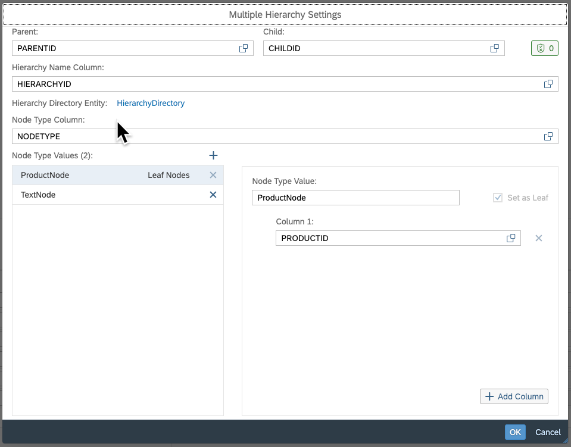

-   Click Deploy

:warning: Note that in the general case like e.g. S/4, multiple columns can be defined for each node type value, thus representing the composite key of the respective dimension. 

### Add external hierarchy to product dimension

Now to associate the new external hierarchy from the product dimension.

-   Open dimension *4VD_Products*
-   Create new assocation of type *Hierarchy with Directory Association*

-   Choose ProductHierarchy from the list of suitable entities

-   Click Deploy

### Update ER model (optional)
It is always good practice to keep the ER model up-to-date for good overview about your modelling. You can also use the impact & lineage graph, if you prefer it, but ER models are a good alternative way of keeping a good eye on your modelling

-   Open ER Model *4EM_Overview_Simple*
-   Select node 4VD_Addresses in the canvas and choose plus sign (+)
-   Choose to add related text entities Countries & Regions
-   Deploy your ER Model

### Update Analytic Model and preview results

As a final step we update the Analytic Model to view the results from this modeling. Remember that the Analytic Model only loads newly updated metadata from lower layers when loading the editor or refreshing the browser page. Then you also need to save & deploy the updated model information.

:warning: 2023-10-26: If below set of steps does not work as expected, it means that Analytic Model hasn't picked up the metadata change. You can enforce a an additional deploy by adding a blank space (" ") to the business name of the Analytic Model and hit deploy. Then repeat the steps above around the Analytic Model. This error is currently in fixing. 

-   Open *4AM_SalesOrderItems* and refresh its browser page
-   Click deploy
-   Open **Preview**
-   Drill by PRODUCTID
-   Choose to show a different hierarchy via the three dots in the Rows area of the Builder panel
-   Choose hierarchy *Men-Women-Kids*

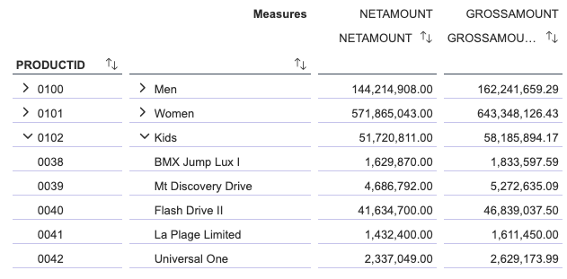

-   Check data and its nodes is now displayed hierarchically. Confirm that roll-ups are performed dynamically on the nodes & leaves

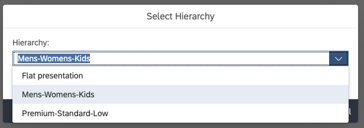

-   Change data access settings of your user from English to French
-   Repeat drilling by PRODUCTID and selecting a different hierarchy for it

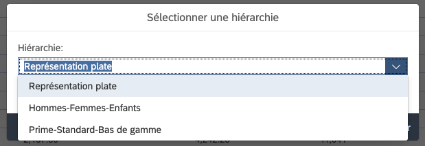

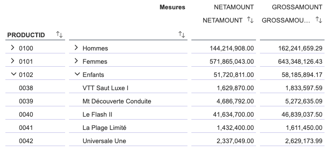

### Optional: Introducing a new hierarchy level "Adults"
Imagine you wanted to group nodes "Men" & "Women" under a common parent "Adults". What would you need to do? Note that SAP Datasphere has a table editor for all local tables which allows users to potentially change data in tables. This is normally reserved for emergency situations, but we'll use it here in order to add rows to the relevant tables. We'll only sketch the solution high-level and leave it to you to do the exact steps
*   Open table HierarchyDirectory and choose Table Editor

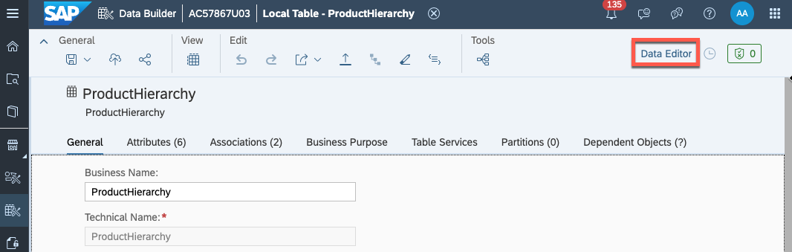
 *  Find rows with CHILDID 0100 and 0101. Think what changes would be required to make them children of a new node *Adults*. Think about how that node would need to look like. You can add rows via the *Add* button

 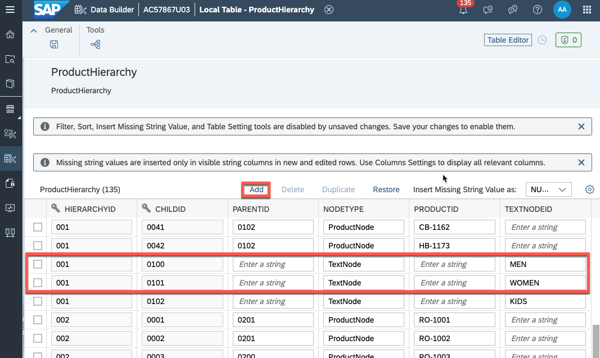
 
 * Save your changes
 * Go back to the Analytic Model data editor and refresh your data

 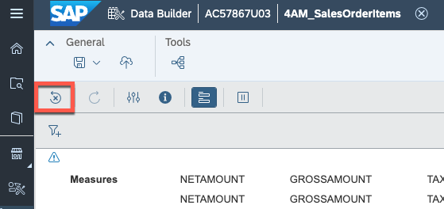

 * Check if your hierarchy now shows a node for adults. 
 * Does it have a proper description? What change needs to happen in order to give it a description? 

## Leverage time-dependent hierarchies
Remember that the marketing department is in the process of developing a new positioning away from *Premium-Standard-Low* towards *Flagship-Core-Others*. That new hierarchy shall go live in 2024 and groups products totally differently. 

Since external hierarchies support time-dependency for complete hierarchies as well as for single nodes & leaves, this requirement can easily be solved

*   Reopen table *HierarchyDirectory*
*   Preview its data. Confirm that hierarchy 002 is only valid in 2023 whereas hierarchy 003 is valid from 2024-01-01 and beyond 
*   Check the modelling [that we did above when we touched table *HierarchyDirectory*](#create-hierarchy-directory-dimension) and worked on the Attributes section. Back then, we assigned semantic type *Business Date - From* to attribute *VALIDFROM* and semantic type *Business Date - To* to attribute *VALIDTO*. With this, we have done all required modelling on the dimension side 
*   Open Analytic Model *4AM_SalesOrderItems*
*   Create a new variable of type *Reference Date Variable*.
*   Set its default to today. 

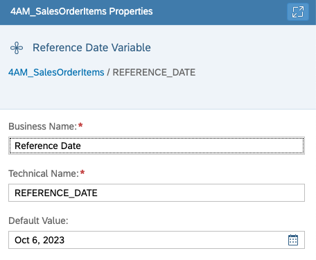

*   Click deploy
*   Preview the data. 
*   The user prompt will ask you for the reference date. Confirm the default. 

:warning: 2023-10-26 The dialog will claim that "Variable is obsolete, ...". Never mind. The message is wrong. The bug is currently in fixing.  

*   Drill by PRODUCTID
*   Open hierarchies for PRODUCTID via the three dots (...). It should show the same hierarchies as before
*   Change the prompt values by clicking the prompt icon of the toolbar

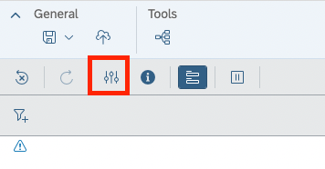

*   Enter any date on or after 2024-01-01 and close the dialog via Set

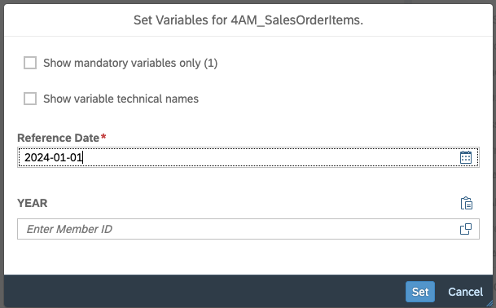

*   Reopen the hierarchy selection again. It should now have replaced hierarchy *Premium-Standard-Low* by *New Strategy 2024*. Choose it. 

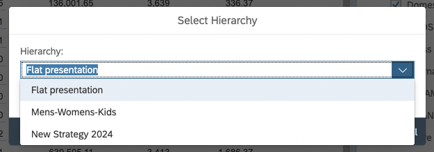

*   Confirm all data is now displayed using the new hierarchy

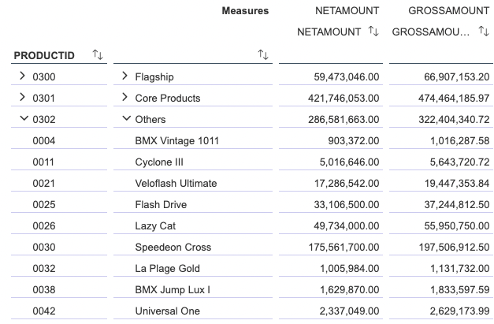

:tada: Welcome to time-dependent hierarchies! 

## Summary

Great work! You were able to configure several hierarchies to use in our Analytic Model and preview their results.

Continue to - [Exercise 4 – Currency Conversion](../ex4/README.md)

:warning: If you skipped [Exercise 2 - Add Labels & Internationalization](../ex2/README.md), you can alternatively do it now also. 
