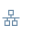

# Currency Conversion

SAP Datasphere can perform currency conversion (aka: currency translation) fully aligned with the [respective functionality in SAP S/4](https://help.sap.com/docs/SAP_S4HANA_ON-PREMISE/8fbeed5f2046489696a50ac7fd76f9c6/d16ebe532789b44ce10000000a174cb4.html?locale=en-US) and SAP BW. The tables TCUR\* play a central role in the conversion since they contain the conversion rates, the list of supported currencies, conversion types and much more. These tables can be brought into SAP Datasphere in a very convenient fashion as described in [SAP Help " Enabling Currency Conversion with TCUR\* Tables and Views "](https://help.sap.com/docs/SAP_DATASPHERE/c8a54ee704e94e15926551293243fd1d/b462239ffb644d9baab4442a10a72edf.html). In essence, with a single click, the respective remote & local tables, the data flows to replicate data between them and convenience wrapper views can be imported into SAP Datasphere via any SAP ABAP connection. Subsequently, the HANA function [CONVERT_CURRENCY](https://help.sap.com/docs/HANA_SERVICE_CF/7c78579ce9b14a669c1f3295b0d8ca16/d22d746ed2951014bb7fb0114ffdaf96.html) does the automatic translation at runtime. For convenience, the SAP Datasphere modelling UIs simplify this by wrapping the currency conversion in easy-to-use modelling UIs.

Currency conversion can be executed both before and after aggregation:

-   with [currency conversion before aggregation](https://help.sap.com/docs/SAP_DATASPHERE/c8a54ee704e94e15926551293243fd1d/6e3d8bed7ece4c27ba10e2cc523915fe.html), the graphical view offers the modelling of a dedicated calculated column in which each row is converted individually. An Analytic Model consuming that view would normally aggregate all those converted values into one overarching figure
-   with [currency conversion after aggregation](https://help.sap.com/docs/SAP_DATASPHERE/c8a54ee704e94e15926551293243fd1d/ec00efb338f3421a87dab4006d7ce6c8.html), the Analytic Model offers a dedicated measure type "Currency Conversion Measure" that converts an already aggregated fact source measure. In this case, instead of converting each record individually and aggregating the converted values, the order is the other way round: first all records are aggregated and then the conversion happens on that final, aggregated figure. This is both preferable from a performance & rounding error perspective.

In the subsequent exercise, we'll

-   get to know the currency semantics in modelling
-   Import currency conversion tables from SAP S/4 and replicate their contents
-   model a currency conversion measure

## Model currency semantics of fact source

So far, all amounts used in reporting, like GROSSAMOUNT and NETAMOUNT are just numbers without dedicated semantics. Since very often sales transactions can happen in different transaction currencies, it might not be justified to aggregate them without taking their transaction currency into account. SAP Datasphere offers a dedicated semantic annotation to point out the relationship between a value (the amount) and its currency (the transaction currency used, when the amount was billed).

-   Open fact 4VF_SalesOrderItems
-   Preview its data
-   Confirm that each sales order item indeed has its transaction currency spelled out in column CURRENCY and its unit spelled out in column QUANTITYUNIT
-   Change semantic types of attributes
    -   set semantic type of CURRENCY to Currency Code
    -   set semantic type of QUANTITYUNIT to Unit of Measures
-   Change semantic type of measures
    -   set semantic type of NETAMOUNT to Amount w Currency and Unit Column to CURRENCY
    -   set semantic type of GROSSAMOUNT to Amount w Currency and Unit Column to CURRENCY
    -   set semantic type of TAXAMOUNT to Amount w Currency and Unit Column to CURRENCY
    -   set semantic type of QUANTITY to Quantity with Unit and Unit Column to QUANTITYUNIT

-   Save & Deploy

## Update Analytic Model and preview results

The new metadata needs to be considered also by the Analytic Model. For it to take note of the updated metadata, the Analytic Model page needs to be loaded newly or refreshed. Subsequently you should save and deploy.

-   Open *4AM_SalesOrderItems* and refresh page
-   Save & deploy
-   Open Data Preview
-   Confirm that all amounts now show a dollar sign behind themselves. The quantity shows a unit symbol (EA for EACH) and the average price is even aware of the division and correctly denotes its unit as \$ / EA, i.e. dollars per piece.

-   

## Aggregation behavior for mixed currency data

Showing a dollar sign behind amounts is simple, but the calculation also changes. Let's manipulate the data and check how our actions influence the aggregation result. Since all data has been replicated into respective tables, we could manually change the data and understand the ripple effects of our changes.

-   Open table *SalesOrderItems*
-   Choose Data Editor
-   Change value of CURRENCY of the first record, i.e. sales order id 0050000001 and item id 0000000010 to EUR
-   Choose save
-   Refresh data preview of *4AM_SalesOrderItems*
-   Confirm that NETAMOUNT, GROSSAMOUNT, TAXAMOUNT and Avg Price now all show \* only, denoting that no value can be displayed  
    
-   Drill by CURRENCY
-   Confirm that now all numbers display normally - the EUR amounts display a Euro sign (€) while the dollar amounts display a USD dollar sign (\$)  
      
    Since all currencies are now clean within each drill-row, aggregation is now correctly supported. Our changed row is displayed with its associated values for NETAMOUNT, GROSSAMOUNT and TAXAMOUNT as well as for its calculations (Avg Price)
-   Go back to the data editor of table *SalesOrderItems* to revert your change (i.e. change CURRENCY back from EUR to USD for the first record)
-   Save your change
-   Refresh the data preview of Analytic Model *4AM_SalesOrderItems*

## Load currency data from S/4 - Generate artfacts

Let's now replicate the currency conversion data from SAP S/4 into respective artefacts in SAP Datasphere. As described in the introduction, this has been packaged very conveniently.

-   Open Data Builder
-   Choose + \> Currency Conversion Views
-   Choose source S4_HANA
-   Open each of the for sections for Remote Tables, Data Flows, Tables & Views and inspect what objects will be created. You might want to read up [background in the documentation](https://help.sap.com/docs/SAP_DATASPHERE/c8a54ee704e94e15926551293243fd1d/b462239ffb644d9baab4442a10a72edf.html).
-   Confirm w CREATE  
    This will generate 32 objects, namely 8 remote tables, 8 data flows, 8 local tables and 8 views
-   Select all objects and deploy
-   Open table Exchange Rates (SAP.CURRENCY.TABLE.TCURR)
-   Preview its data
-   Confirm it contains no data  
    Obviously we still need to run those 8 data flows to actually replicate the data from the remote tables (e.g. SAP.CURRENCY.RTABLE.TCURR) into the local tables. This is also required to ensure satisfactory performance during currency conversion

## Load currency data from S/4 - Run all data flows together via new task chain

We could now run all 8 data flows manually; just open each one and hit run. Since new exchange rate data will regularly be created in S/4, we'd rather have the system do this for us. We’ll prepare the regular replication via a new task flow that automatically executes all 8 data flows. We'll run it manually for our purposes, but we could also schedule it, for e.g. a daily cadence.

-   Create new task chain
-   Open repository section for data flows
-   Drag data flow "Conversion Factors (ODP)" onto the canvas and drop it on the drop zone
-   Choose  sign on the node to add a parallel branch  
    
-   Drag & drop data flow "Currency Code Names (ODP)" onto the new drop zone
-   Repeat this 6 more times so that finally all 8 data flows are in parallel nodes of the same task flow  
    
-   Save & deploy as 4TC_TCUR_Replication
-   Open Data Integration Monitor and authorize system to run task chains in your stead  
    
-   Change to Task Chain Monitor
-   Select entry 4TC_TCUR_Replication and choose Run
-   Choose to see run details of 4TC_TCUR_Replication
-   Refresh regularly until task chain has been executed. This should not take longer than 3-5 minutes
-   Once task chain is completed, reopen Data Builder for table Exchange Rates (SAP.CURRENCY.TABLE.TCURR)
-   Use data preview to confirm that table now contains data

## Create new currency conversion measure in Analytic Model and preview results

Now all groundwork has been laid for automatic currency conversion

-   Open *4AM_SalesOrderItems*
-   Choose to create a new measure of type Currency Conversion Measure
-   Fill its details as follows

    

-   Save & deploy
-   Preview data of Analytic Model
-   Confirm gross amount is now automatically converted and displayed as Gross Sales EUR  
    

## Summary

Way to go! You were able to semantic annotation to point out the relationship between a value and its currency.

This brings us to the end of the TechEd Session on Data Modelling!!

Continue to [Session Wrap-Up](../Session%20Wrap-Up/README.md) for a quick summary of lessons learned.
