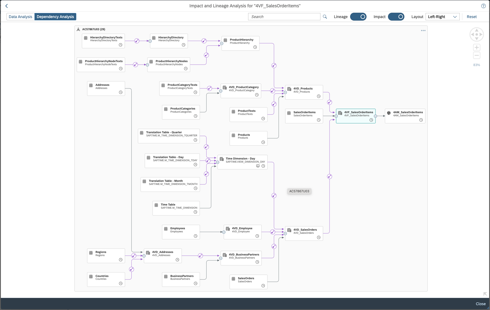

# Overview on exercises and object model

The exercises start from an empty SAP Datasphere space and guide you to build the complete end-to-end scenario from the ground up.  

* In a [first exercise](../ex0/README.md) you'll add required data and a minimal data model. To that end, you will 
    * replicate some tables from a connected SAP HANA Cloud system. These represent a complete data model of a fictional bike manufacturer company. 
    * On top, you'll import an [initial data model](../../model/DA271_DataModel%20-%20Quick%20Start.json) that adds some minimal semantics and assocations between the imported tables. 

    We do this in order to save time for the following, more interesting modelling tasks that form the core of the exercises.  
* In the [Analytic Model exercise](../ex1), you'll build an initial Analytic Model that you quickly extend with rich functionalities. Analytic Models are consumed by SAP Analytics Cloud when users build dashboards on your data. To that end, Analytic Models describe the analytical structure of your data, relevant measures, variables that users are prompted, filters and much more.  
Among others, you'll build some simple and several sophisticated measures. The benefit of building them in the Analytic Model instead of directly in SAP Analytics Cloud is that all definitions are automatically shared between all consumers, i.e. all dashboards. This is particularly useful for KPIs, so that the same KPIs and their definitions are used uniformly across the enterprise.  
After building the model, you'll realize that you'd also like to provide convenience features to your analytics users like 
    * descriptions (e.g. texts to regions, products, user IDs etc)
    * hierarchies (e.g. org hierarchy, product hierarchy, regional hierarchy) and 
    * currency conversion of amounts (so that e.g. gross sales are converted into a reference currency)

    Improving the data model to also cover these requirements is what the subsequent exercises will be about
* In the exercise on [labels & internationalization](../ex2), you make the analysis more readable to your analytics users by automatically providing descriptions to all relevant entities of the analysis
    * Company IDs ("100000000") and user IDs ("0000000001") are translated into their human-readable equivalents ("All for Bikes" and "Derrick Magill" respectively). These are examples of language-independent labels
    * Product codes ("BX-1012") are similarly translated into their marketing names. Since these differ by language (English: "BMX Jump 1012", French: "VTT Saut 1012"), we need to make use of language-dependent descriptions, which automatically leverage the language settings of your user
    * Region codes ("EMEA") and country codes ("US") are equally translated into their language-dependent equivalents (i.e. English: "Europe-Middle East-Africa" and "United States of America" as well as French: "Europe-Moyen Orient-Afrique" and "États-Unis d'Amérique")
* In the [exercise on hierarchies](../ex3/), you'll 
    * first get acquainted with the concept behind hierarchies by concrete looking at the time hierarchy that are pre-delivered for you with SAP Datasphere
    * as next step, you'll model a regional hierarchy in the form of region-country-city by using the concept of [level-based hierarchy](https://help.sap.com/docs/SAP_DATASPHERE/c8a54ee704e94e15926551293243fd1d/218b7e6bd60846dda2f03b789b389cb0.html)
    * next, you'll add an organization hierarchy for employees and their managers by leveraging the concept of [parent-child hierarchies](https://help.sap.com/docs/SAP_DATASPHERE/c8a54ee704e94e15926551293243fd1d/218b7e6bd60846dda2f03b789b389cb0.html)
    * finally, you'll build several product hierarchies that are used in marketing by leveraging the concept of [external hierarchies with directories](https://help.sap.com/docs/SAP_DATASPHERE/c8a54ee704e94e15926551293243fd1d/36c39eee184c485a80ebce9d0fec49ec.html). This very flexible concept allows for many parallel hierarchies, very flexible multi-level structures of different dimensions & text nodes while supporting full language-dependency and time-dependency. While this might sound confusing right now, at the end of the exercise you'll fully master all of these concepts
* In the final [exercise on currency conversion](../ex4/), you'll learn how SAP Datasphere automatically understand the semantic of currencies, like e.g. ensuring that amounts in US dollars and those in Euros should not be added. The system also provides automatic and flexibile currency conversion. To that end, we import the currency conversion rates from a connected SAP S/4 system and build a currency conversion measure that will automatically convert all US dollar amounts in their Euro equivalent. In the future, this conversion will automatically happen towards any currency that users choose (i.e. conversion will use Analytic Model variables)
* After a packed session, the [wrap-up chapter](../Session%20Wrap-Up/) will  summarize your lessons learned. 

:bowtie:
:smile:
:laughing:

[!NOTE]   
test
[!NOTE]\

# Graphical overview of object model
So far on the session overview in text format. Let's now also look at the artefacts and their relationships at the start of the modelling exercises and also how the final object model looks like at the end of the session. 

## Data model right after importing of tables & object model

*Entity-relationship graph of initial data model*

## Final data model after all exercises have been performed

*Entity-relationship graph of final data model*

*Impact & lineage graph of final data model*

